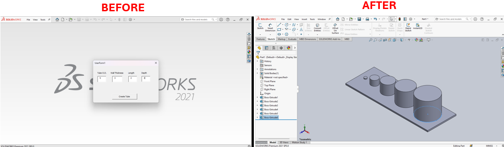

# Cylinder Creation Macro in SolidWorks



## Description
This macro allows users to create an array of cylinders in SolidWorks based on user-defined parameters such as the number of cylinders, radius, height, and extrusion depth. The macro displays a graphical user interface (GUI) where users can enter these values, and then generates the cylinders in a new part document. This tool is useful for quickly generating a set of uniform cylinders in a structured layout.

## System Requirements
- **SolidWorks Version**: SolidWorks 2014 or newer
- **Operating System**: Windows 7 or later

## Pre-Conditions
> [!NOTE]
> - SolidWorks must be open with an active part document.
> - The macro requires user input for cylinder parameters such as quantity, radius, height, and depth.

## Results
> [!NOTE]
> - Creates a specified number of cylinders with the given dimensions.
> - Cylinders are arranged in a linear array with spacing calculated based on radius and quantity.

## STEPS to Setup the Macro

1. **Create the UserForm**:
   - Open the VBA editor in SolidWorks (`Alt + F11`).
   - In the Project Explorer, right-click on the project (e.g., `Macro1`), select **Insert** > **UserForm**.
   - Rename the form as `UserForm1`.
   - Design the form to match the UI provided:
      - Add labels for **Tube O.D.**, **Wall Thickness**, **Length**.
      - Add text boxes below each label for user input (e.g., `Txt1` for Tube O.D., `Txt2` for Wall Thickness, `Txt3` for Length, and `Txt4` for Depth).
      - Add a button labeled **Create Tube** and set its name to `Pcmd`.
   - Optionally, add an image to visually represent the tube dimensions.

2. **Add VBA Code**:
   - Copy the **Macro Code** provided below into the module.
   - Copy the **UserForm Code** into the `UserForm1` code-behind.

3. **Save and Run the Macro**:
   - Save the macro file (e.g., `CreateCylinders.swp`).
   - Run the macro by going to **Tools** > **Macro** > **Run** in SolidWorks, then select your saved macro.

4. **Input Cylinder Parameters**:
   - The macro will open the UserForm. Enter the desired parameters for your cylinders and click **Create Tube**.

## VBA Macro Code

```vbnet
' Disclaimer:
' The code provided should be used at your own risk.  
' Blue Byte Systems Inc. assumes no responsibility for any issues or damages that may arise from using or modifying this code.  
' For more information, visit [Blue Byte Systems Inc.](https://bluebyte.biz).

Option Explicit
Dim swApp As Object
Dim Part As Object
Dim SelMgr As Object
Dim boolstatus As Boolean
Dim longstatus As Long, longwarnings As Long
Dim Feature As Object
Dim ad As String

Sub main()
    UserForm1.Show
End Sub
```

## VBA UserForm Code
```vbnet
Option Explicit
Dim swApp As SldWorks.SldWorks
Dim Part As SldWorks.ModelDoc2
Dim SelMgr As Object
Dim boolstatus As Boolean
Dim longstatus As Long, longwarnings As Long
Dim Feature As Object
Dim ad As String
Dim L As Double
Dim W As Double
Dim R As Double
Dim H As Double
Dim No As Integer
Dim i As Integer
Dim D As Double
Dim flag As Boolean

Private Sub Pcmd_Click()
    Set swApp = Application.SldWorks
    ad = swApp.GetUserPreferenceStringValue(swDefaultTemplatePart)
    swApp.SetUserPreferenceToggle swInputDimValOnCreate, False
    
    Set Part = swApp.NewDocument(ad, 0, 0#, 0#)
    Set Part = swApp.ActiveDoc

    No = Txt1.Value
    R = Txt2.Value / 1000
    H = Txt3.Value / 1000
    L = (10 * (No + 1) + (No / 2) * (4 * 1000 * R + 10 * (No - 1))) / 1000
    W = (20 + 2 * 1000 * R + (No - 1) * 10) / 1000
    D = Txt4.Value / 1000

    ' Create base sketch and extrusion
    boolstatus = Part.Extension.SelectByID2("Top Plane", "PLANE", 0, 0, 0, False, 0, Nothing, 0)
    Part.SketchManager.InsertSketch True
    Part.ClearSelection2 True
    Part.SketchRectangle 0, 0, 0, L, W, 0, 1
    Part.ClearSelection2 True

    ' Set sketch dimensions
    boolstatus = Part.Extension.SelectByID2("Line1", "SKETCHSEGMENT", 0.04195712890625, 0, 0.0004216796875, False, 0, Nothing, 0)
    Dim Annotation As Object
    Set Annotation = Part.AddDimension2(0.0411138, 0, 0.0156021)
    Part.ClearSelection2 True
    Part.Parameter("D1@Sketch1").SystemValue = L
    boolstatus = Part.Extension.SelectByID2("Line2", "SKETCHSEGMENT", -0.00021083984375, 0, -0.0303609375, False, 0, Nothing, 0)
    Set Annotation = Part.AddDimension2(-0.0132829, 0, -0.0303609)
    Part.ClearSelection2 True
    boolstatus = Part.Extension.SelectByID2("D1@Sketch1@Part1.SLDPRT", "DIMENSION", 0, 0, 0, False, 0, Nothing, 0)
    Part.Parameter("D2@Sketch1").SystemValue = W
    Part.ClearSelection2 True

    Part.SketchManager.InsertSketch True
    Part.ShowNamedView2 "*Trimetric", 8
    Part.ClearSelection2 True

    boolstatus = Part.Extension.SelectByID2("Sketch1", "SKETCH", 0, 0, 0, False, 0, Nothing, 0)
    Part.FeatureManager.FeatureExtrusion2 True, False, False, 0, 0, D, 0.01, False, False, False, False, 0.01745329251994, 0.01745329251994, False, False, False, False, 1, 1, 1, 0, 0, False
    Part.SelectionManager.EnableContourSelection = 0

    ' Create cylinders based on input parameters
    For i = 1 To No
        boolstatus = Part.Extension.SelectByID2("", "FACE", L, D, -W / 2, False, 0, Nothing, 0)
        Part.SketchManager.InsertSketch True
        Part.ClearSelection2 True
        Part.CreateCircleByRadius2 (10 * i + (i / 2) * (4 * 1000 * R + 10 * (i - 1)) - R * 1000 - (i - 1) * 5) / 1000, W / 2, 0, (1000 * R + (i - 1) * 5) / 1000
        Part.ClearSelection2 True

        Part.SketchManager.InsertSketch True
        Part.FeatureManager.FeatureExtrusion True, False, False, 0, 0, (1000 * H + 10 * (i - 1)) / 1000, 0.01, False, False, False, False, 0.01745329251994, 0.01745329251994, False, False, False, False, 1, 1, 1
        Part.SelectionManager.EnableContourSelection = 0
    Next

    Part.ViewZoomtofit2
End Sub
```
## Macro
You can download the macro from [here](../images/CreateCylinder.swp)

## Customization
Need to modify the macro to meet specific requirements or integrate it with other processes? We provide custom macro development tailored to your needs. [Contact us](https://bluebyte.biz/contact).

