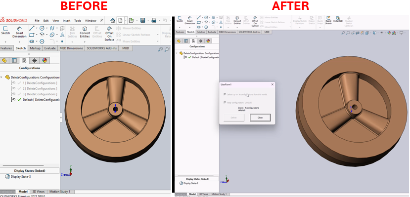

# DeleteAllConfigs: Configuration Management Macro for SolidWorks



## Description
This macro allows for the deletion of configurations from a SolidWorks model while optionally retaining a selected configuration. It provides an interface for users to select configurations for deletion and ensures that at least one configuration remains active in the model.

## System Requirements
- **SolidWorks Version**: SolidWorks 2014 or newer
- **Operating System**: Windows 7 or later

## Pre-Conditions
- A SolidWorks part or assembly must be open with multiple configurations.
- The macro should be executed within the SolidWorks environment with access rights to modify document properties.

## Results
- Users can selectively delete configurations from a model.
- Provides feedback on the number of configurations deleted.
- Ensures that at least one configuration, typically the "Default" configuration, remains undisturbed.

## Steps to Setup the Macro

1. **Create the UserForm**:
   - Open the VBA editor in SolidWorks by pressing (`Alt + F11`).
   - In the Project Explorer, locate the `DeleteAllConfigs` project.
   - Right-click on `Forms` and select **Insert** > **UserForm**.
     - Rename the newly created form to `FormDeleteConfigs`.
     - Design the form with the following components:
       - Checkboxes: `CheckDeleteConfigs` and `CheckKeepConfig` to select deletion options.
       - Buttons: `Delete` and `Cancel` to execute or abort the deletion process.
       - Label: `LabelConfigsDeleted` to display the status of operations.

2. **Implement the Module**:
   - Right-click on `Modules` within the `DeleteAllConfigs` project.
   - Select **Insert** > **Module**.
   - Add the VBA code to this module (`DeleteConfigs`) to handle the logic for deleting configurations based on the user's selections.

3. **Configure Event Handlers**:
   - In the `FormDeleteConfigs`, implement event handlers for the `Delete` and `Cancel` buttons.
   - Use `ProcessCheck` to enable or disable the `Delete` button based on checkbox states.

4. **Save and Run the Macro**:
   - Save the macro file (e.g., `DeleteAllConfigs.swp`).
   - Run the macro by navigating to **Tools** > **Macro** > **Run** in SolidWorks, then select your saved macro.

5. **Using the Macro**:
   - The macro will open the `FormDeleteConfigs`.
   - Select the appropriate checkboxes to configure the deletion process.
   - Use the `Delete` button to remove configurations, or `Cancel` to close the form without making changes.

## VBA Macro Code

```vbnet
'------------------------------------------------------------------------------
' DeleteAllConfigs.swp 
'------------------------------------------------------------------------------
Global swApp As Object
Global ModelDoc2 As Object
Global Configuration As Object
Global FileTyp As String
Global numConfigs As Integer
Global ConfigNames As Variant
Global Retval As Integer
Global DelCount As Integer
' SolidWorks constants
Global Const swDocPART = 1
Global Const swDocASSEMBLY = 2
Global Const swMbWarning = 1
Global Const swMbInformation = 2
Global Const swMbQuestion = 3
Global Const swMbStop = 4
Global Const swMbAbortRetryIgnore = 1
Global Const swMbOk = 2
Global Const swMbOkCancel = 3
Global Const swMbRetryCancel = 4
Global Const swMbYesNo = 5
Global Const swMbYesNoCancel = 6
Global Const swMbHitAbort = 1
Global Const swMbHitIgnore = 2
Global Const swMbHitNo = 3
Global Const swMbHitOk = 4
Global Const swMbHitRetry = 5
Global Const swMbHitYes = 6
Global Const swMbHitCancel = 7

'------------------------------------------------------------------------------
' Delete extra configurations from model and set current config to Default
'------------------------------------------------------------------------------
Sub Main()
  Set swApp = CreateObject("SldWorks.Application")            ' Attach to SWX
  Set ModelDoc2 = swApp.ActiveDoc                             ' Grab active doc
  If ModelDoc2 Is Nothing Then                                ' Is doc loaded
    MsgBox "No model loaded."                                 ' Nothing - Warn
  Else                                                        ' Doc loaded?
    FileTyp = ModelDoc2.GetType                               ' Get doc type
    If FileTyp = swDocASSEMBLY Or FileTyp = swDocPART Then    ' Doc model?
      numConfigs = ModelDoc2.GetConfigurationCount()          ' Get # configs
      If numConfigs > 1 Then                                  ' Check # configs
        FormDeleteConfigs.Show
      Else                                                    ' Else # config
        MsgBox "Only one configuration exists in this model."
      End If                                                  ' End # config
    Else                                                      ' Else doc type
      MsgBox "Active file is not a SolidWorks model."
    End If                                                    ' End doc type
  End If                                                      ' End doc load

End Sub
```

## VBA UserForm Code

```vbnet
'------------------------------------------------------------------------------
' DeleteAllConfigs.swp
'------------------------------------------------------------------------------
Private Sub CheckDeleteConfigs_Click()
  ProcessCheck
End Sub

Private Sub CheckKeepConfig_Click()
  ProcessCheck
End Sub

Private Sub ProcessCheck()
  If CheckDeleteConfigs = True And CheckKeepConfig = True Then
    CommandDelete.Enabled = True
  Else
    CommandDelete.Enabled = False
  End If
End Sub

Private Sub CommandCancel_Click()
  End
End Sub

Private Sub CommandDelete_Click()
  ConfigNames = ModelDoc2.GetConfigurationNames()
  For i = 0 To (numConfigs - 1)                     ' For each config
    If ConfigNames(i) <> CurrentConfigName Then     ' Not active conf
      ModelDoc2.DeleteConfiguration2 ConfigNames(i) ' delete config
      DelCount = DelCount + 1                       ' Inc del counter
      LabelConfigsDeleted = "Processing: " + Str(DelCount) + " configurations."
      FormDeleteConfigs.Repaint
    End If                                          ' active config
  Next                                              ' Get next config
  Configuration.Name = "Default"                    ' Set config to
  Configuration.AlternateName = "Default"           ' "Default" &
  Configuration.UseAlternateNameInBOM = 0           ' AlternateName
  DelCount = (DelCount + 1) - ModelDoc2.GetConfigurationCount()
  LabelConfigsDeleted = "Done: " + Str(DelCount) + " configurations deleted."
  CheckDeleteConfigs.Enabled = False
  CheckKeepConfig.Enabled = False
  CommandDelete.Enabled = False
  CommandCancel.Caption = "Close"
End Sub

Private Sub UserForm_Initialize()
  ProcessCheck
  CheckDeleteConfigs.Caption = "Delete up to " + Str(ModelDoc2.GetConfigurationCount()) _
                        + " configurations from this model."
  Set Configuration = ModelDoc2.GetActiveConfiguration
  CheckKeepConfig.Caption = "Keep configuration: '" + Configuration.Name + "'"
  LabelConfigsDeleted = ""
End Sub
```

## Macro
You can download the macro from [here](../images/DeleteConfigurations.swp)

## Customization
Need to modify the macro to meet specific requirements or integrate it with other processes? We provide custom macro development tailored to your needs. [Contact us](https://bluebyte.biz/contact).