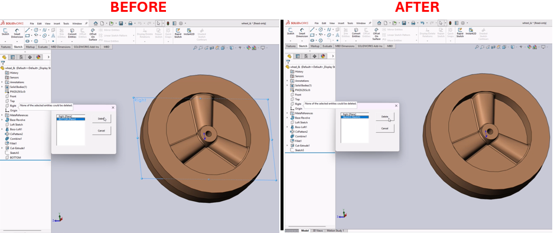

# Delete Features with No Children Macro for SolidWorks



## Description
This macro identifies and allows users to delete features with no children (redundant features) in a SolidWorks model. The macro supports features like planes, coordinate systems, axes, sketches, and more.

## System Requirements
- **SolidWorks Version**: SolidWorks 2014 or newer  
- **Operating System**: Windows 7 or later  

## Pre-Conditions
> [!NOTE]
> - A part document must be open in SolidWorks.  
> - The macro works only on features that have no dependencies.

## Results
> [!NOTE]
> - A user interface lists redundant features.  
> - Users can select features to delete directly from the interface.

## Steps to Setup the Macro

### 1. **Create the Form in the VBA Editor**:
- Open the VBA editor in SolidWorks by pressing (`Alt + F11`).
- In the VBA editor, go to **Insert > UserForm** to create a new form.
- Add the following elements to the form:
  - **ListBox**:
    - Name: `ListBox1`
    - Positioned to display feature names.
  - **Command Buttons**:
    - **Delete Button**:
      - Name: `CommandButton1`
      - Caption: `Delete`
    - **Cancel Button**:
      - Name: `CommandButton2`
      - Caption: `Cancel`
- Adjust the form’s caption to **Delete features with no children**.
- Save the macro project.

### 2: **Run the Macro**
- Open a part document in SolidWorks.
- Run the macro.
- The form will display all redundant features. Select the features you want to delete and click **Delete**.

## VBA Macro Code

### **DeleteRedundantFeatures Module**

```vbnet
' Disclaimer:
' The code provided should be used at your own risk.  
' Blue Byte Systems Inc. assumes no responsibility for any issues or damages that may arise from using or modifying this code.  
' For more information, visit [Blue Byte Systems Inc.](https://bluebyte.biz).

Option Explicit

' Declare global variables
Dim swApp As SldWorks.SldWorks                ' SolidWorks application object
Dim swModel As SldWorks.ModelDoc2             ' Active document object
Dim swFeat As SldWorks.Feature                ' Feature object
Dim swPart As SldWorks.PartDoc                ' Part document object
Dim sFeatName() As String                     ' Array to store feature names

' Populate the dialog box with features
Sub populate()
    ReDim sFeatName(0)                        ' Initialize the feature name array
    Dialog.ListBox1.Clear                     ' Clear existing items in the ListBox

    ' Get the first feature in the model
    Set swFeat = swModel.FirstFeature

    ' Traverse through all features in the model
    Do While Not swFeat Is Nothing
        FeatureHasChildren swFeat             ' Check if the feature has children and process it
        Set swFeat = swFeat.GetNextFeature    ' Move to the next feature
    Loop
End Sub

' Check if a feature has children and add it to the ListBox if applicable
Sub FeatureHasChildren(feature As SldWorks.Feature)
    Dim childArray As Variant
    Dim featType As String

    childArray = feature.GetChildren          ' Get child features

    ' Skip features with children
    If Not IsEmpty(childArray) Then Exit Sub 

    featType = ""                             ' Initialize feature type

    ' Map feature type names to human-readable labels
    If feature.GetTypeName = "RefPlane" Then featType = "Plane"
    If feature.GetTypeName = "CoordSys" Then featType = "CSYS"
    If feature.GetTypeName = "RefAxis" Then featType = "Axis"
    If feature.GetTypeName = "ProfileFeature" Then featType = "Sketch"
    If feature.GetTypeName = "3DProfileFeature" Then featType = "3D Sketch"
    If feature.GetTypeName = "RefPoint" Then featType = "Point"

    ' Add feature to the ListBox and array if it matches one of the predefined types
    If Not featType = "" Then
        sFeatName(UBound(sFeatName)) = feature.Name
        ReDim Preserve sFeatName(UBound(sFeatName) + 1)   ' Resize array to accommodate the next feature
        Dialog.ListBox1.AddItem feature.Name & " (" & featType & ")"  ' Add to ListBox
        Dialog.ListBox1.Selected(Dialog.ListBox1.ListCount - 1) = True ' Preselect in ListBox
    End If
End Sub

' Delete selected features from the ListBox
Sub DeleteFeatures()
    Set swPart = swModel                     ' Set the active document as the part object
    swModel.ClearSelection                   ' Clear any existing selection in the model

    Dim i As Integer
    Dim bRet As Boolean

    ' Iterate through the ListBox to find selected items
    For i = 0 To Dialog.ListBox1.ListCount - 1
        If Dialog.ListBox1.Selected(i) = True Then
           ' Get the feature by name and delete it
           Set swFeat = swPart.FeatureByName(sFeatName(i))
           If Not swFeat Is Nothing Then
                bRet = swFeat.Select2(True, 0)       ' Select the feature
                bRet = swModel.DeleteSelection(False) ' Delete the selected feature
           End If
        End If
    Next

    populate                                 ' Refresh the ListBox
End Sub

' Main entry point of the macro
Sub main()
    ' Initialize SolidWorks application and active document
    Set swApp = Application.SldWorks
    Set swModel = swApp.ActiveDoc

    ' Ensure a document is open
    If swModel Is Nothing Then
        MsgBox "Model Player requires an active part", vbCritical
        Exit Sub
    End If

    populate                                 ' Populate the ListBox with features
    Dialog.Show                              ' Display the dialog box
End Sub
```

## VBA UserForm Code

```vbnet
Option Explicit

Private Sub CommandButton1_Click()
    ' Execute the DeleteFeatures subroutine
    DeleteRedundantFeatures.DeleteFeatures
End Sub

Private Sub CommandButton2_Click()
    ' Exit the macro
    Unload Me
    End
End Sub
```

## Macro
You can download the macro from [here](../images/DeleteRedundantFeatures.swp)

## Customization
Need to modify the macro to meet specific requirements or integrate it with other processes? We provide custom macro development tailored to your needs. [Contact us](https://bluebyte.biz/contact).