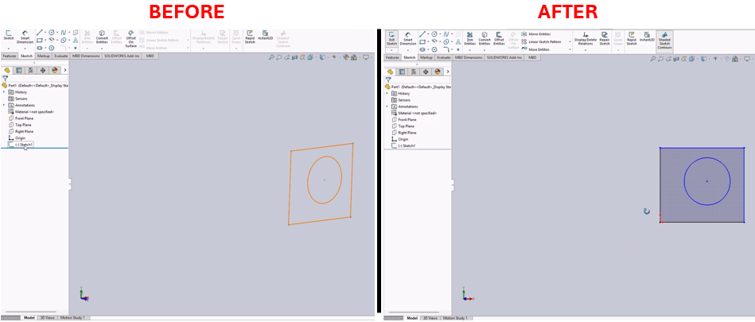

# Edit Sketch Macro for SolidWorks



## Description
This macro automates sketch editing within SolidWorks based on the active document and the selected entities. It adjusts the view to normal for an active sketch or exits the sketch if the view is already normal. The macro supports resolving selected subcomponents and digging into the sketch hierarchy for more complex features.

## System Requirements
- **SolidWorks Version**: SolidWorks 2014 or newer
- **Operating System**: Windows 7 or later

## Pre-Conditions
> [!NOTE]
> - An active part or assembly document must be open in SolidWorks.
> - A feature, face, edge, or sketch should be selected for proper operation.

## Results
> [!NOTE]
> - Edits the driving sketch of the selected feature or geometry and makes the view normal.
> - Exits the active sketch if already in a normal view.
> - Automatically resolves selected subcomponents if suppressed.

## Steps to Setup the Macro

### 1. **Run the Macro**:
   - Execute the macro while a SolidWorks document is active.
   - Ensure that the document type is supported (part or assembly) and appropriate entities are selected.

### 2. **Behavior Based on Selection**:
   - If a feature or geometry is selected, the macro opens the driving sketch and adjusts the view.
   - If no entities are selected, and the sketch is active, the macro adjusts the view to normal.
   - If the view is already normal, the macro exits the sketch.

## VBA Macro Code

```vbnet
' Disclaimer:
' The code provided should be used at your own risk.  
' Blue Byte Systems Inc. assumes no responsibility for any issues or damages that may arise from using or modifying this code.  
' For more information, visit [Blue Byte Systems Inc.](https://bluebyte.biz).

Option Explicit

' Define a structure for storing view data
Type ViewData
    ViewScale As Double                           ' Scale of the view
    Orientation As SldWorks.MathTransform         ' Orientation transformation matrix
    Translation As SldWorks.MathVector            ' Translation vector
End Type

' Enum for comparison results between two views
Enum CompareViewResult_e
    Same = 0                                      ' Views are identical
    DiffOrientation = 2 ^ 0                       ' Different orientations
    difftranslation = 2 ^ 1                       ' Different translations
    diffscale = 2 ^ 2                             ' Different scales
End Enum

' Debugging constants and tolerance
Const Bug As Boolean = False                      ' Debug output flag
Const Tol As Integer = 2                          ' Tolerance for comparisons

Sub main()
    On Error Resume Next

    Dim swApp As SldWorks.SldWorks
    Dim swDoc As SldWorks.ModelDoc2
    Dim SelMgr As SldWorks.SelectionMgr
    Dim swFeat As SldWorks.Feature
    Dim swSelType As Long
    Dim StartView As ViewData
    Dim CurView As ViewData
    Dim compRes As CompareViewResult_e

    ' Initialize SolidWorks objects
    Set swApp = Application.SldWorks
    Set swDoc = swApp.ActiveDoc
    Set SelMgr = swDoc.SelectionManager
    StartView = GetViewData(swDoc.ActiveView)

    ' Check if a sketch is active
    If Not swDoc.GetActiveSketch2 Is Nothing Then
        ' No selection: Align view "normal to" the sketch
        If SelMgr.GetSelectedObjectCount2(-1) < 1 Then
            swDoc.ShowNamedView2 "*Normal To", -1
            CurView = GetViewData(swDoc.ActiveView)
            compRes = CompareViewData(StartView, CurView, Tol)
            If compRes = Same Then
                swDoc.SketchManager.InsertSketch True
                Exit Sub
            End If
        Else
            swDoc.SketchManager.InsertSketch True
        End If
    End If

    ' Resolve selected feature or entity
    swSelType = SelMgr.GetSelectedObjectType3(1, -1)
    Select Case swSelType
        Case swSelFACES, swSelEDGES
            Set swFeat = SelMgr.GetSelectedObject6(1, -1).GetFeature
            If swFeat Is Nothing Then Exit Sub
        Case swSelBODYFEATURES, swSelSKETCHES
            Set swFeat = SelMgr.GetSelectedObject6(1, -1)
        Case Else
            Exit Sub
    End Select

    ' Edit sketch or feature
    If swFeat.GetTypeName = "ProfileFeature" Then
        swDoc.EditSketchOrSingleSketchFeature
    Else
        swDoc.FeatEdit
    End If

    ' Align view to "normal to" if a sketch is active
    If Not swDoc.GetActiveSketch2 Is Nothing Then
        swDoc.ShowNamedView2 "*Normal To", -1
    End If

    ' Clear selections
    swDoc.ClearSelection2 True
End Sub

' Function to get view data (scale, orientation, translation)
Private Function GetViewData(view As SldWorks.ModelView) As ViewData
    Dim data As ViewData
    Set data.Orientation = view.Orientation3       ' Get orientation matrix
    Set data.Translation = view.Translation3       ' Get translation vector
    data.ViewScale = view.Scale2                   ' Get view scale
    GetViewData = data
End Function

' Function to compare two sets of view data
Private Function CompareViewData(firstViewData As ViewData, secondViewData As ViewData, Tol As Integer) As CompareViewResult_e
    Dim res As CompareViewResult_e
    res = Same

    ' Compare orientation
    If Not CompareArrays(firstViewData.Orientation.ArrayData, secondViewData.Orientation.ArrayData, Tol) Then
        res = res + DiffOrientation
    End If

    ' Compare translation
    If Not CompareArrays(firstViewData.Translation.ArrayData, secondViewData.Translation.ArrayData, Tol) Then
        res = res + difftranslation
    End If

    ' Compare scale
    If Not TolerantEqual(firstViewData.ViewScale, secondViewData.ViewScale, Tol) Then
        res = res + diffscale
    End If

    CompareViewData = res
End Function

' Function to compare arrays with tolerance
Private Function CompareArrays(firstArr As Variant, secondArr As Variant, Tol As Integer) As Boolean
    If UBound(firstArr) = UBound(secondArr) Then
        Dim i As Integer
        For i = 0 To UBound(firstArr)
            If Not TolerantEqual(firstArr(i), secondArr(i), Tol) Then
                CompareArrays = False
                Exit Function
            End If
        Next
        CompareArrays = True
    Else
        CompareArrays = False
    End If
End Function

' Function to compare two numbers with tolerance
Private Function TolerantEqual(a As Variant, b As Variant, Tol As Integer) As Boolean
    TolerantEqual = Abs(a - b) <= Abs(a / 10 ^ Tol) ' Compare within tolerance
End Function
```
## Macro
You can download the macro from [here](../images/EditSketch.swp)

## Customization
Need to modify the macro to meet specific requirements or integrate it with other processes? We provide custom macro development tailored to your needs. [Contact us](https://bluebyte.biz/contact).