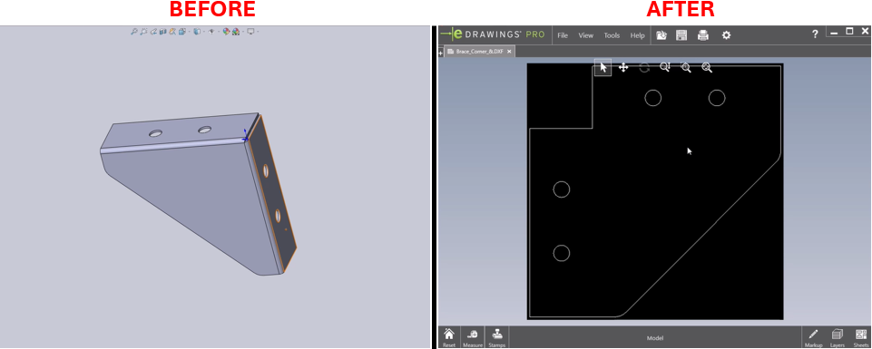

# Export Custom-Named Sketches to DXF



## Description
This macro hides all the bodies and sketches in the active part, then looks at all features to identify custom-named sketches. For each custom-named sketch, the macro will unhide the sketch, view normal to its plane, insert the view into a new drawing, set the scale to 1:1, save the drawing as a DXF file, and then close the drawing.

## System Requirements
- **SolidWorks Version**: SolidWorks 2014 or newer
- **Operating System**: Windows 7 or later

## Pre-Conditions
> [!NOTE]
> - The active document must be a part file.
> - Sketches should be custom-named for the macro to process them individually.
> - The macro assumes that a drawing template is available and accessible to create the new drawings.

## Results
> [!NOTE]
> - All bodies and sketches in the part are hidden.
> - Custom-named sketches are displayed and exported as DXF files.
> - Each sketch view is set to a 1:1 scale in the drawing before saving.

## VBA Macro Code

```vbnet
' Disclaimer:
' The code provided should be used at your own risk.  
' Blue Byte Systems Inc. assumes no responsibility for any issues or damages that may arise from using or modifying this code.  
' For more information, visit [Blue Byte Systems Inc.](https://bluebyte.biz).

Option Explicit

' --------------------------------------------------------------------------
' Main subroutine to process custom-named sketches and export as DXF
' --------------------------------------------------------------------------
Sub main()

    ' Declare and initialize necessary SolidWorks objects
    Dim swApp As SldWorks.SldWorks               ' SolidWorks application object
    Dim PART As SldWorks.PartDoc                 ' Part document object
    Dim swModel As SldWorks.ModelDoc2            ' Model document object for the part
    Dim featmgr As SldWorks.FeatureManager       ' Feature manager object to access features
    Dim feat As Variant                          ' Individual feature object
    Dim feats As Variant                         ' Array of features in the part
    Dim selmgr As SldWorks.SelectionMgr          ' Selection manager object
    Dim swbody As Variant                        ' Individual body object
    Dim bodies As Variant                        ' Array of bodies in the part
    Dim body As SldWorks.Body2                   ' Body object in the part
    Dim LONGSTATUS As Long                       ' Long variable for capturing status
    Dim DRAW As SldWorks.DrawingDoc              ' Drawing document object for new drawings
    Dim currentSheet As SldWorks.Sheet           ' Current sheet object in the drawing
    Dim BOOLSTATUS As Boolean                    ' Boolean variable for operation results
    Dim myView As Object                         ' View object for creating drawing views
    Dim closedoc As ModelDoc2                    ' Object to handle and close documents

    ' Initialize SolidWorks application and get the active part document
    Set swApp = Application.SldWorks
    Set PART = swApp.ActiveDoc
    Set swModel = swApp.ActiveDoc
    Set selmgr = swModel.SelectionManager
    Set featmgr = swModel.FeatureManager

    ' Hide all bodies in the active part
    bodies = PART.GetBodies2(swAllBodies, False)
    For Each swbody In bodies
        swbody.HideBody (True)
    Next

    ' Hide all sketches in the active part
    feats = featmgr.GetFeatures(False)
    For Each feat In feats
        If feat.GetTypeName = "ProfileFeature" Then
            feat.Select (False)  ' Select the feature without adding to the current selection
            swModel.BlankSketch  ' Hide the selected sketch
        End If
    Next

    ' Process each feature to identify and export custom-named sketches
    For Each feat In feats
        ' Check if the feature is a sketch and if it is custom-named (not containing "Sketch" in its name)
        If feat.GetTypeName = "ProfileFeature" And InStr(feat.Name, "Sketch") < 1 Then

            ' Unhide the custom-named sketch
            feat.Select (False)
            swModel.UnblankSketch

            ' Orient the view to be normal to the sketch plane
            feat.Select (False)
            swModel.Extension.RunCommand swCommands_NormalTo, ""

            ' Create a new drawing document for the sketch view
            Set DRAW = swApp.NewDocument(swApp.GetUserPreferenceStringValue(swUserPreferenceStringValue_e.swDefaultTemplateDrawing), 2, 0.2794, 0.4318)

            ' Insert the current sketch view into the drawing
            Set myView = DRAW.CreateDrawViewFromModelView3(swModel.GetPathName, "Current Model View", 0, 0, 0)

            ' Set the scale of the drawing view to 1:1
            Set currentSheet = DRAW.GetCurrentSheet
            BOOLSTATUS = currentSheet.SetScale(1, 1, True, False)

            ' Save the drawing as a DXF file in the same folder as the part
            Set closedoc = DRAW
            LONGSTATUS = closedoc.SaveAs3(Left(swModel.GetPathName, Len(swModel.GetPathName) - 7 - Len(GetTitle(swModel.GetPathName))) & GetTitle(swModel.GetPathName) & " " & feat.Name & ".DXF", 0, 0)

            ' Close the drawing document after saving
            swApp.CloseDoc (closedoc.GetTitle)

            ' Hide the sketch again after exporting
            feat.Select (False)
            swModel.BlankSketch

        End If
    Next

End Sub

' --------------------------------------------------------------------------
' Function to extract the title (filename without extension) from the path
' --------------------------------------------------------------------------
Public Function GetTitle(Path As String) As String

    ' Declare necessary variables
    Dim path1 As Variant                         ' Array to hold path segments
    Dim title As String                          ' Extracted title (filename without extension)

    ' Split the path into segments based on "\"
    path1 = Split(Path, "\")

    ' Get the last segment of the path as the filename
    title = path1(UBound(path1))

    ' Return the title without the file extension
    GetTitle = Left(title, InStr(title, ".") - 1)

End Function
```

## Macro
You can download the macro from [here](../images/ExportSketchToDxf2.swp)

## Customization
Need to modify the macro to meet specific requirements or integrate it with other processes? We provide custom macro development tailored to your needs. [Contact us](https://bluebyte.biz/contact).