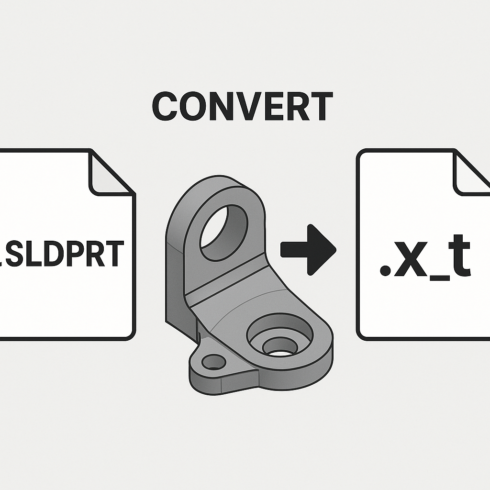

# Traverse Assembly and Save Parts as Parasolid (X_T)



## Description
This macro traverses the active assembly and saves all child components (parts) as Parasolid files (X_T format) in the specified folder. It recursively traverses through the assembly hierarchy, ensuring that all parts are saved with their respective names. This macro simplifies the process of saving parts in an assembly by automatically exporting them to the desired location.

## System Requirements
- **SolidWorks Version**: SolidWorks 2014 or newer
- **Operating System**: Windows 7 or later

## Pre-Conditions
> [!NOTE]
> - The active document must be an assembly.
> - A folder path must be provided where the Parasolid files will be saved.

## Results
> [!NOTE]
> - All parts within the active assembly are saved as Parasolid (X_T) files.
> - The files will be saved in the specified folder with the same names as the parts.
> - The macro will skip any parts that are already open or in a suppressed state.

## VBA Macro Code

```vbnet
' Disclaimer:
' The code provided should be used at your own risk.  
' Blue Byte Systems Inc. assumes no responsibility for any issues or damages that may arise from using or modifying this code.  
' For more information, visit [Blue Byte Systems Inc.](https://bluebyte.biz).

Option Explicit

' --------------------------------------------------------------------------
' Main subroutine to initialize the process and prompt the user for a save path
' --------------------------------------------------------------------------
Sub main()

    ' Declare necessary SolidWorks objects
    Dim swApp As SldWorks.SldWorks              ' SolidWorks application object
    Dim swModel As SldWorks.ModelDoc2           ' Active document object (assembly)
    Dim savepath As String                      ' User input for the folder path to save Parasolid files

    ' Initialize SolidWorks application and get the active document
    Set swApp = Application.SldWorks
    Set swModel = swApp.ActiveDoc

    ' Check if there is an active document open
    If swModel Is Nothing Then
        MsgBox "No active document found. Please open an assembly and try again.", vbCritical, "No Active Document"
        Exit Sub
    End If

    ' Prompt user for the folder path to save Parasolid files
    savepath = InputBox("Where do you want to save the Parasolid (X_T) files?")

    ' Call the traverse function to iterate through components and save as Parasolid files
    traverse swApp.ActiveDoc, savepath

End Sub

' --------------------------------------------------------------------------
' Recursive function to traverse through the assembly components and save parts
' --------------------------------------------------------------------------
Function traverse(Pathname As ModelDoc2, savepath As String)

    ' Declare necessary variables and objects
    Dim swApp As SldWorks.SldWorks                  ' SolidWorks application object
    Dim swModel As SldWorks.ModelDoc2               ' Model document object for components
    Dim swConfMgr As SldWorks.ConfigurationManager  ' Configuration manager object
    Dim swConf As SldWorks.Configuration            ' Configuration object for the active configuration
    Dim swRootComp As SldWorks.Component2           ' Root component of the assembly
    Dim vChildComp As Variant                       ' Array of child components in the assembly
    Dim swChildComp As SldWorks.Component2          ' Individual child component object
    Dim i As Long                                   ' Loop counter for iterating through child components
    Dim longstatus As Long                          ' Status variable for capturing save operations

    ' Initialize SolidWorks application
    Set swApp = Application.SldWorks
    Set swModel = Pathname ' Set the model to the input pathname (active document)
    
    ' Get the configuration manager and active configuration of the model
    Set swConfMgr = swModel.ConfigurationManager
    Set swConf = swConfMgr.ActiveConfiguration

    ' Get the root component of the assembly
    Set swRootComp = swConf.GetRootComponent3(True)

    ' Get the child components of the root component
    vChildComp = swRootComp.GetChildren

    ' Loop through each child component in the assembly
    For i = 0 To UBound(vChildComp)
        Set swChildComp = vChildComp(i) ' Set the child component

        ' Get the model document of the child component
        Set swModel = swChildComp.GetModelDoc2

        ' If the child component is a part, traverse further or save as Parasolid (X_T)
        If Not swModel Is Nothing Then

            ' Check if the component is an assembly (type 2 = swDocASSEMBLY)
            If swModel.GetType = 2 Then
                ' Recursively traverse through sub-assemblies
                traverse swModel, savepath
            Else
                ' Save the part as a Parasolid (X_T) file in the specified folder
                longstatus = swModel.SaveAs3(savepath & "\" & swModel.GetTitle & ".X_T", 0, 0)
            End If
        End If
    Next i

End Function

' --------------------------------------------------------------------------
' Function to extract the title (filename without extension) from the path
' --------------------------------------------------------------------------
Public Function GetTitle(Path As String) As String

    ' Declare necessary variables
    Dim path1 As Variant                         ' Array to hold path segments
    Dim title As String                          ' Extracted title (filename without extension)

    ' Split the path into segments based on "\"
    path1 = Split(Path, "\")

    ' Get the last segment of the path as the filename
    title = path1(UBound(path1))

    ' Return the title without the file extension
    GetTitle = Left(title, InStr(title, ".") - 1)

End Function
```

## Macro
You can download the macro from [here](../images/ExportAsPARASOLID.swp)

## Customization
Need to modify the macro to meet specific requirements or integrate it with other processes? We provide custom macro development tailored to your needs. [Contact us](https://bluebyte.biz/contact).