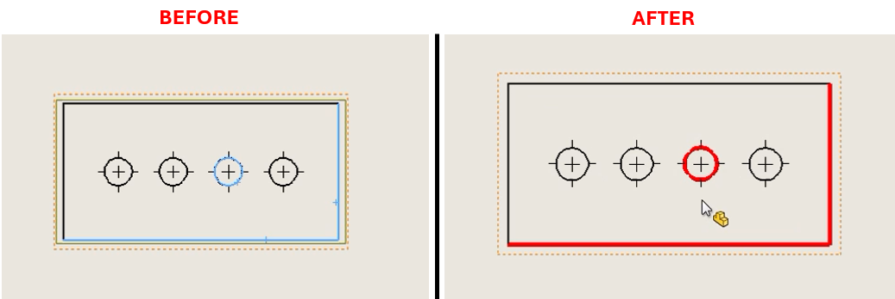

# Apply Custom Line Width and Color to Selected Edge in SolidWorks Drawing



## Description
This macro applies custom line properties (color and width) to selected edges in a SolidWorks drawing. It helps users visually differentiate specific edges or lines in a drawing by changing their appearance based on the specified properties.

## System Requirements
- **SolidWorks Version**: SolidWorks 2014 or newer
- **Operating System**: Windows 7 or later

## Pre-Conditions
> [!NOTE]
> - The active document must be a drawing file.
> - The user must select at least one edge in the drawing before running the macro.

## Results
> [!NOTE]
> - The selected edge(s) will have their line width and color updated based on the specified properties.
> - A confirmation message will be shown if the operation is successful, or an error message if there are any issues.

## VBA Macro Code

```vbnet
' Disclaimer:
' The code provided should be used at your own risk.  
' Blue Byte Systems Inc. assumes no responsibility for any issues or damages that may arise from using or modifying this code.  
' For more information, visit [Blue Byte Systems Inc.](https://bluebyte.biz).

Option Explicit

Sub main()

    ' Declare SolidWorks application object and initialize it
    Dim swApp As SldWorks.SldWorks
    Set swApp = Application.SldWorks
    
    ' Get the currently active document
    Dim swModel As SldWorks.ModelDoc2
    Set swModel = swApp.ActiveDoc

    ' Check if there is an active document
    If Not swModel Is Nothing Then
        ' Check if the active document is a drawing
        If swModel.GetType = swDocDRAWING Then
            ' Declare drawing document object and selection manager object
            Dim swDraw As SldWorks.DrawingDoc
            Set swDraw = swModel
            Dim swSelMgr As SldWorks.SelectionMgr
            Set swSelMgr = swModel.SelectionManager

            ' Check if any edge is selected in the drawing
            If swSelMgr.GetSelectedObjectCount2(-1) > 0 Then
                
                ' Specify custom line properties
                Dim edgeWidth As Double
                Dim edgeColor As Integer
                edgeWidth = 0.0007          ' Line width in meters (e.g., 0.0007m = 0.7mm)
                edgeColor = 255             ' Color in RGB (e.g., 255 = Red)

                ' Apply custom line width and color to the selected edge(s)
                swDraw.SetLineWidthCustom (edgeWidth)
                swDraw.SetLineColor edgeColor

                ' Notify the user of successful application
                MsgBox "Line width and color applied successfully to the selected edge(s).", vbInformation, "Success"
            Else
                ' Error message if no edge is selected
                MsgBox "Please select at least one edge in the drawing to apply the properties.", vbExclamation, "No Edge Selected"
            End If
        Else
            ' Error message if the active document is not a drawing
            MsgBox "The active document is not a drawing. Please open a drawing and select an edge.", vbExclamation, "Invalid Document Type"
        End If
    Else
        ' Error message if no document is open
        MsgBox "No active document found. Please open a drawing and select an edge.", vbExclamation, "No Active Document"
    End If

End Sub
```

## Macro
You can download the macro from [here](../images/FormatLine.swp)

## Customization
Need to modify the macro to meet specific requirements or integrate it with other processes? We provide custom macro development tailored to your needs. [Contact us](https://bluebyte.biz/contact).