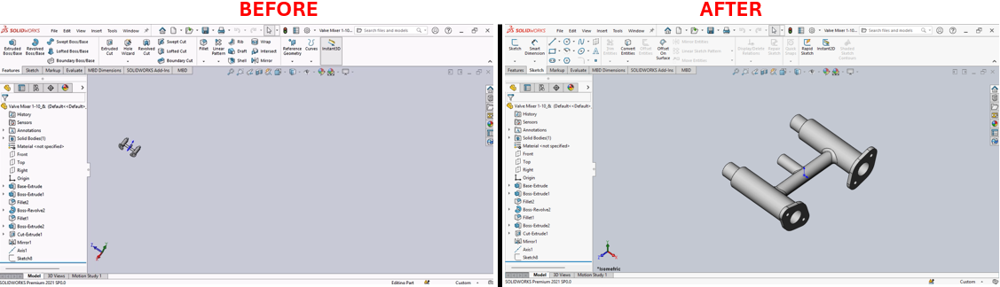

# Create ISO Views Macro for SolidWorks



## Description
This macro generates eight custom named ISO views in an active SolidWorks document, providing various orientations based on the front, right, back, and left perspectives from both top and bottom angles.

## System Requirements
- **SolidWorks Version**: SolidWorks 2014 or newer
- **Operating System**: Windows 7 or later

## Pre-Conditions
> [!NOTE]
> - An active SolidWorks document must be open.
> - The document should preferably be a 3D model where ISO views will provide meaningful perspectives.

## Results
> [!NOTE]
> - Eight custom ISO views are created: Top-front-right (TRF-ISO), Top-right-rear (TRR-ISO), Top-left-rear (TLR-ISO), Top-left-front (TLF-ISO), Bottom-right-front (BRF-ISO), Bottom-right-rear (BRR-ISO), Bottom-left-rear (BLR-ISO), and Bottom-left-front (BLF-ISO).
> - Previous ISO views with these names are deleted before new views are created to ensure there are no duplicates.

## Steps to Setup the Macro

1. **Open the Document**:
   - Ensure that a 3D model document is open in SolidWorks where ISO views can be meaningfully generated.

2. **Load and Run the Macro**:
   - Open the SolidWorks VBA editor by pressing (`Alt + F11`).
   - Insert a new module and paste the provided macro code.
   - Run the macro directly from the VBA editor or within SolidWorks under **Tools** > **Macro** > **Run**.

3. **Using the Macro**:
   - The macro will automatically delete any existing named views that match the intended output to prevent duplicates.
   - New ISO views will be created and saved under custom names for quick access.

## VBA Macro Code

```vbnet
' Disclaimer:
' The code provided should be used at your own risk.  
' Blue Byte Systems Inc. assumes no responsibility for any issues or damages that may arise from using or modifying this code.  
' For more information, visit [Blue Byte Systems Inc.](https://bluebyte.biz).

' *********************************************************
' Description:
' This macro creates a series of isometric views and saves them as named views in the active SolidWorks document.
' *********************************************************

Sub main()
    ' Declare SolidWorks application and document variables
    Dim swApp As Object                            ' SolidWorks application object
    Dim Part As Object                             ' Active document object
    Dim boolstatus As Boolean                      ' Boolean to capture status (not used in this macro)
    Dim longstatus As Long                         ' Long status for operations (not used in this macro)
    Dim Annotation As Object                       ' Annotation object placeholder (not used here)
    Dim Gtol As Object                             ' Geometric tolerance object placeholder (not used here)
    Dim DatumTag As Object                         ' Datum tag object placeholder (not used here)
    Dim FeatureData As Object                      ' Feature data placeholder (not used here)
    Dim Feature As Object                          ' Feature object placeholder (not used here)
    Dim Component As Object                        ' Component object placeholder (not used here)

    ' Initialize SolidWorks application and active document
    Set swApp = Application.SldWorks
    Set Part = swApp.ActiveDoc

    ' Check if a document is open
    If Part Is Nothing Then
        MsgBox "No active document found. Please open a model.", vbExclamation, "Error"
        Exit Sub
    End If

    ' Define mathematical constants and view transformations
    pi = 4 * Atn(1)                               ' Value of π (pi)
    Z = Tan(30 * pi / 180)                        ' Tangent of 30 degrees
    X = Atn(Z / Sqr(-Z * Z + 1))                  ' Rotation angle in radians for X-axis
    Y = -45 * pi / 180                            ' Rotation angle in radians for Y-axis

    ' Delete previously saved ISO views to ensure clean state
    Part.DeleteNamedView ("TRF-ISO")
    Part.DeleteNamedView ("TRR-ISO")
    Part.DeleteNamedView ("TLF-ISO")
    Part.DeleteNamedView ("TLR-ISO")
    Part.DeleteNamedView ("BRF-ISO")
    Part.DeleteNamedView ("BRR-ISO")
    Part.DeleteNamedView ("BLF-ISO")
    Part.DeleteNamedView ("BLR-ISO")

    ' Create and save named views for different ISO perspectives
    ' Top Right Front ISO View
    Part.ShowNamedView2 "*Front", -1
    Part.ActiveView().RotateAboutCenter X, Y
    Part.ViewZoomtofit
    Part.NameView ("TRF-ISO")

    ' Top Right Rear ISO View
    Part.ShowNamedView2 "*Right", -1
    Part.ActiveView().RotateAboutCenter X, Y
    Part.ViewZoomtofit
    Part.NameView ("TRR-ISO")

    ' Top Left Rear ISO View
    Part.ShowNamedView2 "*Back", -1
    Part.ActiveView().RotateAboutCenter X, Y
    Part.ViewZoomtofit
    Part.NameView ("TLR-ISO")

    ' Top Left Front ISO View
    Part.ShowNamedView2 "*Left", -1
    Part.ActiveView().RotateAboutCenter X, Y
    Part.ViewZoomtofit
    Part.NameView ("TLF-ISO")

    ' Bottom Right Front ISO View
    Part.ShowNamedView2 "*Front", -1
    Part.ActiveView().RotateAboutCenter -X, Y
    Part.ViewZoomtofit
    Part.NameView ("BRF-ISO")

    ' Bottom Right Rear ISO View
    Part.ShowNamedView2 "*Right", -1
    Part.ActiveView().RotateAboutCenter -X, Y
    Part.ViewZoomtofit
    Part.NameView ("BRR-ISO")

    ' Bottom Left Rear ISO View
    Part.ShowNamedView2 "*Back", -1
    Part.ActiveView().RotateAboutCenter -X, Y
    Part.ViewZoomtofit
    Part.NameView ("BLR-ISO")

    ' Bottom Left Front ISO View
    Part.ShowNamedView2 "*Left", -1
    Part.ActiveView().RotateAboutCenter -X, Y
    Part.ViewZoomtofit
    Part.NameView ("BLF-ISO")

    ' Clean up objects
    Set Part = Nothing
    Set swApp = Nothing
End Sub
```

## Macro
You can download the macro from [here](../images/ISOViews.swp)

## Customization
Need to modify the macro to meet specific requirements or integrate it with other processes? We provide custom macro development tailored to your needs. [Contact us](https://bluebyte.biz/contact).