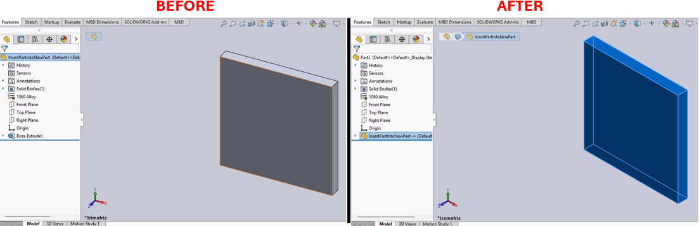

# Insert Part into a New Part Macro for SolidWorks



## Description
This macro creates a new part document in SolidWorks and inserts the currently active part into it. It also copies the material properties from the original part to the new part. This is particularly useful for creating derived parts with similar material properties but potentially different geometries or features.

## System Requirements
- **SolidWorks Version**: SolidWorks 2014 or newer
- **Operating System**: Windows 7 or later

## Pre-Conditions
> [!NOTE]
> - A part document must be currently active in SolidWorks.

## Results
> [!NOTE]
> - A new part document is created.
> - The active part is inserted into the new part document.
> - Material properties are copied from the original part to the new part.

## Steps to Setup the Macro

### 1. **Open the Part Document**:
   - Ensure that the part document you want to replicate into a new part is currently active in SolidWorks.

### 2. **Load and Execute the Macro**:
   - Load the macro into SolidWorks using the VBA editor (`Alt + F11`).
   - Execute the macro from within SolidWorks by navigating to **Tools** > **Macro** > **Run**.

## VBA Macro Code

```vbnet
' Disclaimer:
' The code provided should be used at your own risk.  
' Blue Byte Systems Inc. assumes no responsibility for any issues or damages that may arise from using or modifying this code.  
' For more information, visit [Blue Byte Systems Inc.](https://bluebyte.biz).

' ******************************************************************************
' Insert Part into a New Part
' Description: This macro inserts the currently active SolidWorks part into a new part,
'              copies the material properties, and adjusts the view.
' ******************************************************************************
Option Explicit

' Global variables for SolidWorks application and document objects
Dim swApp As SldWorks.SldWorks                    ' SolidWorks application object
Dim Part, Parent As Object                        ' Objects for new part and parent part
Dim boolstatus As Boolean                         ' Boolean status for operations
Dim longstatus As Long, longwarnings As Long      ' Status and warnings for operations
Dim Parent_FullPathName As String                 ' Full path of the parent part
Dim EmptyStr As String                            ' Placeholder for empty strings
Dim myFeature As Object                           ' Feature object for inserting the part
Dim sMatName As String                            ' Material name of the parent part
Dim sMatDB As String                              ' Material database path

Sub main()
    ' Initialize SolidWorks application
    Set swApp = Application.SldWorks
    Set Parent = swApp.ActiveDoc                  ' Get the currently active document

    ' Precondition: Exit quietly if the active document is not a part
    If (Parent.GetType <> swDocPART) Then Exit Sub

    ' Get the full path name of the parent part
    Parent_FullPathName = Parent.GetPathName

    ' Get the short name (title) of the parent part and remove the file extension if present
    Dim ParentName As String
    ParentName = Parent.GetTitle
    If InStr(1, ParentName, ".") Then
        ParentName = Left$(ParentName, InStr(1, ParentName, ".") - 1)
    End If

    ' Get the material name and database path of the parent part
    sMatName = Parent.GetMaterialPropertyName2("", sMatDB)

    ' Create a new part
    Set Part = swApp.NewPart

    ' Insert the parent part into the new part
    Set myFeature = Part.InsertPart2(Parent_FullPathName, 1)
    Part.ClearSelection2 True                    ' Clear any selections in the new part

    ' Set the view to isometric and fit the window
    Part.ShowNamedView2 "*Isometric", 7
    Part.ViewZoomtofit2

    ' Copy material from the parent part to the new part
    Part.SetMaterialPropertyName "SOLIDWORKS Materials.sldmat", sMatName

    ' Clean up references to objects
    Set Parent = Nothing
    Set Part = Nothing
End Sub
```

## Macro
You can download the macro from [here](../images/InsertPartIntoNewPart.swp)

## Customization
Need to modify the macro to meet specific requirements or integrate it with other processes? We provide custom macro development tailored to your needs. [Contact us](https://bluebyte.biz/contact).