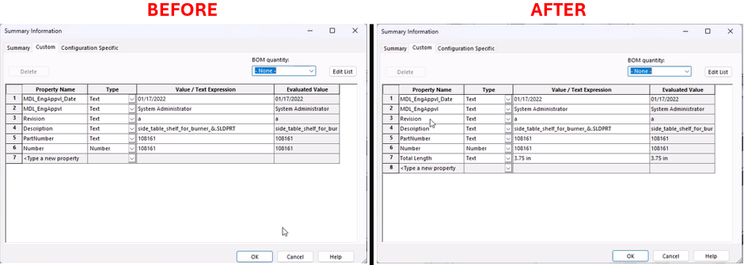

# Measure Sketch and Add Length Property



## Description
This macro measures the length of all the segments in the selected sketch of the active model file and adds the total length as a custom property with a value in inches or millimeters (up to 2 decimal places). The macro checks the model units and accordingly converts the total length into inches or mm based on the current unit system of the document.

## System Requirements
- **SolidWorks Version**: SolidWorks 2014 or newer
- **Operating System**: Windows 7 or later

## Pre-Conditions
> [!NOTE]
> - The desired sketch must be selected from the feature manager before running the macro.
> - The active document must be a part or assembly.
> - The sketch should not contain any construction geometry or text, as these are ignored in the length calculation.

## Results
> [!NOTE]
> - The macro calculates the total length of all the sketch segments in the selected sketch.
> - A custom property named "Total Length" is added to the part or assembly with the length value in inches or mm, depending on the document units.
> - A message box will be displayed if no sketch is selected or the active document is not a part or assembly.

## VBA Macro Code

```vbnet
' Disclaimer:
' The code provided should be used at your own risk.  
' Blue Byte Systems Inc. assumes no responsibility for any issues or damages that may arise from using or modifying this code.  
' For more information, visit [Blue Byte Systems Inc.](https://bluebyte.biz).

Option Explicit

Public Enum swSkchSegments_e
    swSketchLINE = 0
    swSketchARC = 1
    swSketchELLIPSE = 2
    swSketchSPLINE = 3
    swSketchTEXT = 4
    swSketchPARABOLA = 5
End Enum

Sub main()

    ' Declare and initialize necessary SolidWorks objects
    Dim swApp As SldWorks.SldWorks             ' SolidWorks application object
    Dim swModel As SldWorks.ModelDoc2          ' Active document object (part or assembly)
    Dim swSelMgr As SldWorks.SelectionMgr      ' Selection manager object
    Dim swFeat As SldWorks.Feature             ' Feature object for the selected sketch
    Dim swSketch As SldWorks.sketch            ' Sketch object to store the selected sketch
    Dim swCustProp As CustomPropertyManager    ' Custom property manager for adding properties to the model
    Dim swSkchSeg As SldWorks.SketchSegment    ' Sketch segment object for each segment in the sketch
    Dim UserUnit As UserUnit                   ' User unit object to determine the document's unit system
    Dim i As Long                              ' Loop counter for iterating through sketch segments
    Dim bRet As Boolean                        ' Return status of custom property addition
    Dim vSkchSeg As Variant                    ' Array to hold the sketch segments in the selected sketch
    Dim nLength As Double                      ' Total length of the sketch segments

    ' Initialize SolidWorks application and get the active document
    Set swApp = Application.SldWorks
    Set swModel = swApp.ActiveDoc
    
    ' Check if a document is currently active
    If swModel Is Nothing Then
        MsgBox "No active document found. Please open a part or assembly and try again.", vbCritical, "No Active Document"
        Exit Sub
    End If
    
    ' Check if the active document is a part or assembly (skip if it's a drawing)
    If swModel.GetType = 3 Then
        MsgBox "This macro only works on parts or assemblies. Please open a part or assembly and try again.", vbCritical, "Invalid Document Type"
        Exit Sub
    End If
    
    ' Get the user unit system (e.g., metric or imperial)
    Set UserUnit = swModel.GetUserUnit(swUserUnitsType_e.swLengthUnit)
    
    ' Get the selection manager object
    Set swSelMgr = swModel.SelectionManager
    
    ' Check if a sketch is selected in the feature manager
    If swSelMgr.GetSelectedObjectCount2(-1) > 0 And swSelMgr.GetSelectedObjectType3(1, -1) = swSelSKETCHES Then
        ' Get the selected sketch feature
        Set swFeat = swSelMgr.GetSelectedObject5(1)
        Set swSketch = swFeat.GetSpecificFeature2
        ' Get all the sketch segments in the selected sketch
        vSkchSeg = swSketch.GetSketchSegments
        
        ' Loop through each segment in the sketch
        For i = 0 To UBound(vSkchSeg)
            Set swSkchSeg = vSkchSeg(i)
            ' Ignore construction lines and text segments
            If swSkchSeg.ConstructionGeometry = False Then
                If swSketchTEXT <> swSkchSeg.GetType Then
                    ' Accumulate the length of valid sketch segments
                    nLength = nLength + swSkchSeg.GetLength
                End If
            End If
        Next i

        ' Clear any selections in the document
        swModel.ClearSelection2 True

        ' Get the custom property manager object for the active document
        Set swCustProp = swModel.Extension.CustomPropertyManager("")

        ' Add the total length as a custom property in inches or mm based on the unit system
        If UserUnit.IsMetric = False Then
            bRet = swCustProp.Add3("Total Length", 30, Round(nLength * 39.3701, 2) & " in", 1) ' Add total length in inches
        ElseIf UserUnit.IsMetric Then
            bRet = swCustProp.Add3("Total Length", 30, Round(nLength * 1000, 2) & " mm", 1) ' Add total length in mm
        End If
        
    Else
        ' Show error message if no sketch is selected
        MsgBox "Please select a sketch from the feature manager and try again.", vbExclamation, "No Sketch Selected"
        Exit Sub
    End If

End Sub
```

## Macro
You can download the macro from [here](../images/MeasureSketchAndAddLengthProperty.swp)

## Customization
Need to modify the macro to meet specific requirements or integrate it with other processes? We provide custom macro development tailored to your needs. [Contact us](https://bluebyte.biz/contact).
