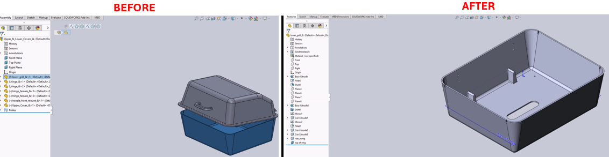

# Open Selected Part Separately from Assembly in SolidWorks



## Description
This macro enables users to select a part in an assembly and open it in a separate window with a single command. The macro can be conveniently assigned to a keyboard shortcut (e.g., the 'O' key) for quick access, making it faster to edit parts without manually navigating through the assembly.

## System Requirements
- **SolidWorks Version**: SolidWorks 2014 or newer
- **Operating System**: Windows 7 or later

## Pre-Conditions
> [!NOTE]
> - The active document must be an assembly with at least one part.
> - A part in the assembly must be selected before running this macro.

## Results
> [!NOTE]
> - Opens the selected part in a new SolidWorks window.
> - The main assembly remains open, allowing quick switching between the assembly and the part.


## VBA Macro Code

```vbnet
' Disclaimer:
' The code provided should be used at your own risk.  
' Blue Byte Systems Inc. assumes no responsibility for any issues or damages that may arise from using or modifying this code.  
' For more information, visit [Blue Byte Systems Inc.](https://bluebyte.biz).

Option Explicit

Dim swApp As Object
Dim Part As Object

Sub main()
    Set swApp = Application.SldWorks
    Set Part = swApp.ActiveDoc

    ' Attempt to open the selected component part
    Part.OpenCompFile
End Sub
```

## Macro
You can download the macro from [here](../images/OpenSelectedPart.swp)

## Customization
Need to modify the macro to meet specific requirements or integrate it with other processes? We provide custom macro development tailored to your needs. [Contact us](https://bluebyte.biz/contact).