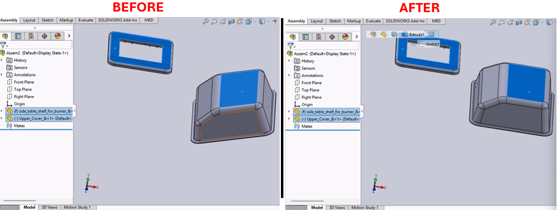

# Mate Addition and Rebuild Macro for SolidWorks



## Description
This macro automates the addition of a specific type of mate (e.g., coincident mate) to a selected component in an assembly document. After adding the mate, it forces a rebuild of the assembly to ensure that all changes take effect.

## System Requirements
- **SolidWorks Version**: SolidWorks 2014 or newer
- **Operating System**: Windows 7 or later

## Pre-Conditions
> [!NOTE]
> - An assembly document must be open in SolidWorks.
> - The component to which the mate is to be applied must be selected prior to running the macro.

## Results
> [!NOTE]
> - Adds a specified mate to the selected component.
> - Forces a rebuild of the assembly to reflect the new mate addition.
> - Clears any selections to tidy up the workspace post-operation.

## Steps to Setup the Macro

1. **Prepare the Assembly Document**:
   - Open the assembly document in SolidWorks.
   - Select the component to which you want to apply the mate.

2. **Load and Run the Macro**:
   - Open the SolidWorks VBA editor by pressing (`Alt + F11`).
   - Insert a new module and paste the provided macro code into this module.
   - Run the macro directly from the VBA editor or save and run it from within SolidWorks under **Tools** > **Macro** > **Run**.

3. **Using the Macro**:
   - The macro will automatically add the specified mate to the selected component.
   - After execution, the assembly is rebuilt to apply the changes, and the selection is cleared.

## VBA Macro Code

```vbnet
' Disclaimer:
' The code provided should be used at your own risk.  
' Blue Byte Systems Inc. assumes no responsibility for any issues or damages that may arise from using or modifying this code.  
' For more information, visit [Blue Byte Systems Inc.](https://bluebyte.biz).

Option Explicit

' Main subroutine to add a coincident mate to the selected component in an assembly
Sub main()
    ' Declare and set SolidWorks application and document variables
    Dim swApp As SldWorks.SldWorks            ' SolidWorks application object
    Set swApp = Application.SldWorks
    Dim Part As SldWorks.ModelDoc2            ' Active document object
    Set Part = swApp.ActiveDoc

    ' Validate if a document is loaded
    If Part Is Nothing Then
        MsgBox "No document is open.", vbExclamation, "Error"
        Exit Sub ' Exit if no document is loaded
    End If

    ' Declare variables for operations
    Dim boolstatus As Boolean                 ' Status of the operation (not used directly here)
    Dim longstatus As Long                    ' Long status to capture errors or warnings
    Dim longwarnings As Long                  ' Long warnings (not used directly here)
    Dim Feature As Object                     ' Object for the newly added mate

    ' Add a coincident mate to the selected component
    ' Parameters:
    ' - Mate type: 3 (Coincident)
    ' - Alignment: 2 (Aligned)
    ' - Flip flag: False (No flipping)
    ' - Distance/Angle: All set to 0 for this mate type
    ' - Long status: Captures the success or failure of the mate addition
    Set Feature = Part.AddMate2(3, 2, False, 0, 0, 0, 1, 1, 0, 0, 0, longstatus)

    ' Check if the mate was successfully added
    If longstatus <> 0 Then
        MsgBox "Failed to add mate. Status code: " & longstatus, vbCritical, "Error"
        Exit Sub
    End If

    ' Force a rebuild to update the assembly with the new mate
    Part.ForceRebuild

    ' Clear any remaining selections to ensure a clean state
    Part.ClearSelection2 True

    ' Notify the user of successful operation
    MsgBox "Coincident mate added successfully.", vbInformation, "Success"
End Sub
```

## Macro
You can download the macro from [here](../images/ParallelMate.swp)

## Customization
Need to modify the macro to meet specific requirements or integrate it with other processes? We provide custom macro development tailored to your needs. [Contact us](https://bluebyte.biz/contact).