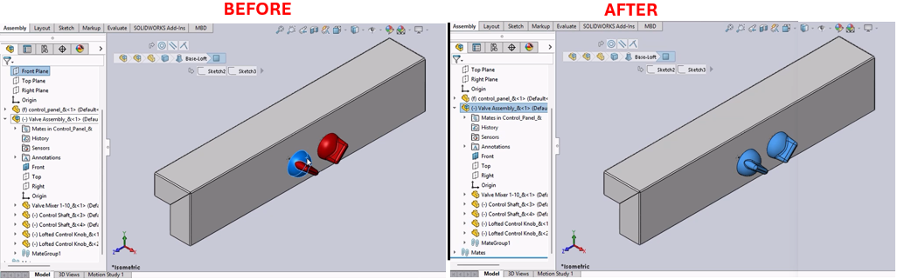

# Parent Assembly Selector Macro for SolidWorks



## Description
This macro selects the parent assembly of the currently selected assembly component in SolidWorks. It is particularly useful for navigating assembly hierarchies and understanding component relationships within complex assemblies.

## System Requirements
- **SolidWorks Version**: SolidWorks 2014 or newer
- **Operating System**: Windows 7 or later

## Pre-Conditions
> [!NOTE]
> - An assembly document must be open.
> - At least one component must be selected within the assembly.

## Results
> [!NOTE]
> - The selection in the assembly will be replaced with its parent assembly component.

## Steps to Setup the Macro

1. **Create the VBA Modules**:
   - Open the SolidWorks VBA editor by pressing (`Alt + F11`).
   - Insert a new module into your project and copy the provided macro code into this module.

2. **Run the Macro**:
   - Ensure that an assembly with selectable components is open.
   - Run the macro from within SolidWorks by navigating to **Tools** > **Macro** > **Run**, then select your saved macro file.

3. **Using the Macro**:
   - The macro will automatically replace the last selected item with its parent assembly, making it the active selection.
   - If the selected item has no parent assembly or is already a top-level component, no changes will be made to the selection.

## VBA Macro Code

```vbnet
' Disclaimer:
' The code provided should be used at your own risk.  
' Blue Byte Systems Inc. assumes no responsibility for any issues or damages that may arise from using or modifying this code.  
' For more information, visit [Blue Byte Systems Inc.](https://bluebyte.biz).

' SolidWorks VBA macro to select the parent assembly of a selected component

Option Explicit

' Main subroutine
Sub main()
    ' Declare variables for SolidWorks objects and operations
    Dim swApp As SldWorks.SldWorks                  ' SolidWorks application object
    Dim swModel As SldWorks.ModelDoc2               ' Active document object
    Dim swSelMgr As SldWorks.SelectionMgr           ' Selection manager object
    Dim swSelComp As SldWorks.Component2            ' Selected assembly component object
    Dim bRet As Boolean                             ' Boolean for operation success
    Dim i As Integer                                ' Loop counter (unused in this version)
    Dim CurSelCount As Long                         ' Number of selected objects
    Dim NewObjToSelect As Object                    ' Object to select (parent assembly)
    Dim DwgDocComp As DrawingComponent              ' Drawing component object for drawings
    Dim OldToggleVal As Long                        ' Stores the previous toggle state of a user preference

    ' Initialize the SolidWorks application and active document
    Set swApp = Application.SldWorks
    Set swModel = swApp.ActiveDoc

    ' Check if a document is open
    If swModel Is Nothing Then Exit Sub

    ' Validate the document type (must be assembly or assembly drawing)
    If swModel.GetType = swDocPART Then
        Exit Sub ' Exit if the document is a part
    ElseIf swModel.GetType = swDocDRAWING Then
        ' Check if the drawing references a part document
        If swModel.ActiveDrawingView.ReferencedDocument.GetType = swDocPART Then
            Exit Sub ' Exit if the referenced document is a part
        End If
    End If

    ' Get the selection manager
    Set swSelMgr = swModel.SelectionManager

    ' Get the number of selected objects
    CurSelCount = swSelMgr.GetSelectedObjectCount
    If CurSelCount = 0 Then
        MsgBox "Nothing was selected"
        Exit Sub
    End If

    ' Get the selected object (component or drawing component)
    If swModel.GetType = swDocDRAWING Then
        ' For drawings, retrieve the component associated with the drawing view
        Set DwgDocComp = swSelMgr.GetSelectedObjectsComponent2(CurSelCount)
        Set swSelComp = DwgDocComp.Component
    Else
        ' For assemblies, get the selected assembly component
        Set swSelComp = swSelMgr.GetSelectedObjectsComponent(CurSelCount)
    End If

    ' Get the parent assembly of the selected component
    Set NewObjToSelect = swSelComp.GetParent
    If Not NewObjToSelect Is Nothing Then
        ' Deselect the current selection
        swSelMgr.DeSelect CurSelCount
        
        If swModel.GetType = swDocDRAWING Then
            ' For drawings, adjust selection to the drawing context
            Set NewObjToSelect = NewObjToSelect.GetDrawingComponent(swSelMgr.GetSelectedObject6(swSelMgr.GetSelectedObjectCount2(-1), -1))
            swModel.ClearSelection2 True

            ' Temporarily disable the property manager auto-show preference
            OldToggleVal = swApp.GetUserPreferenceToggle(swAutoShowPropertyManager)
            swApp.SetUserPreferenceToggle swAutoShowPropertyManager, False

            ' Select the new object (parent assembly)
            bRet = NewObjToSelect.Select(True, Nothing)

            ' Restore the original preference toggle value
            swApp.SetUserPreferenceToggle swAutoShowPropertyManager, OldToggleVal
        Else
            ' For assemblies, directly select the parent assembly
            bRet = NewObjToSelect.Select(True)
        End If
    End If
End Sub
```

## Macro
You can download the macro from [here](../images/ParentSelect.swp)

## Customization
Need to modify the macro to meet specific requirements or integrate it with other processes? We provide custom macro development tailored to your needs. [Contact us](https://bluebyte.biz/contact).