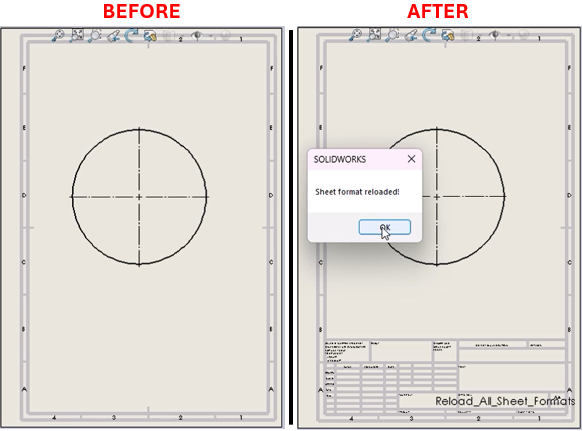

# Reloading Sheet Formats in Drawing Documents



## Description
This macro automates the process of reloading sheet formats across all sheets in a SolidWorks drawing document. It iterates through each sheet, temporarily removes the current format, and then reloads the original template. The macro ensures that all drawing sheets are updated with their default formats and concludes by rebuilding and saving the document, improving efficiency in drawing maintenance and formatting updates.

## System Requirements
- **SolidWorks Version**: SolidWorks 2014 or newer
- **Operating System**: Windows 10 or later
- **Excel Version**: Microsoft Excel 2010 or later (for Excel integration features)

## Pre-Conditions
> [!NOTE]
> - SolidWorks must be installed and running on the machine.
> - An active drawing is open.

## Post-Conditions
> [!NOTE]
> - The macro will first remove the existing sheet format and then reload the previous format from the specified location for each sheet.
> - Note: This may remove all content contained within the old/existing format.

 
## VBA Macro Code

```vbnet
' Disclaimer:
' The code provided should be used at your own risk.  
' Blue Byte Systems Inc. assumes no responsibility for any issues or damages that may arise from using or modifying this code.  
' For more information, visit [Blue Byte Systems Inc.](https://bluebyte.biz).

Option Explicit

Sub main()

    Dim swApp As SldWorks.SldWorks
    Dim swModel As SldWorks.ModelDoc2
    Dim swDraw As SldWorks.DrawingDoc
    Dim swSheet As SldWorks.Sheet
    Dim vSheetProps As Variant
    Dim vSheetName As Variant
    Dim vTemplateName As Variant

    Dim longstatus As Long
    Dim longwarnings As Long
    Dim nErrors As Long
    Dim nWarnings As Long
    Dim i As Long

    ' Initialize SolidWorks application
    Set swApp = Application.SldWorks
    Set swModel = swApp.ActiveDoc

    ' Check if an active drawing is open
    If swModel Is Nothing Then
        MsgBox "There is no active drawing document."
        Exit Sub
    End If
    
    ' Ensure the active document is a drawing
    If swModel.GetType <> swDocDRAWING Then
        MsgBox "Open a drawing first and then try again!"
        Exit Sub
    End If

    Set swDraw = swModel
    vSheetName = swDraw.GetSheetNames

    ' Traverse and update each sheet in the drawing
    For i = 0 To UBound(vSheetName)
        swDraw.ActivateSheet vSheetName(i)
        Set swSheet = swDraw.GetCurrentSheet
        
        ' Retrieve sheet properties and format template
        vTemplateName = swSheet.GetTemplateName
        vSheetProps = swSheet.GetProperties
        
        ' Remove the current sheet format
        swModel.SetupSheet5 swSheet.GetName, swDwgPapersUserDefined, swDwgTemplateNone, _
                            vSheetProps(2), vSheetProps(3), False, "", _
                            vSheetProps(5), vSheetProps(6), "Default", True
                            
        ' Reload the original sheet format
        swModel.SetupSheet5 swSheet.GetName, swDwgPapersUserDefined, swDwgTemplateCustom, _
                            vSheetProps(2), vSheetProps(3), False, vTemplateName, _
                            vSheetProps(5), vSheetProps(6), "Default", True
                            
        swDraw.ViewZoomtofit2
    Next i

    ' Activate the first sheet and force rebuild
    swDraw.ActivateSheet vSheetName(0)
    swDraw.ForceRebuild3 False
    
    ' Save the drawing
    swDraw.Save3 1, nErrors, nWarnings

    ' Clean up
    Set swDraw = Nothing
    Set swModel = Nothing
    Set swApp = Nothing

    MsgBox "Sheet format reloaded!"

End Sub
```

## Macro
You can download the macro from [here](../images/Reload_All_Sheet_Formats.swp)

## Customization
Need to modify the macro to meet specific requirements or integrate it with other processes? We provide custom macro development tailored to your needs. [Contact us](https://bluebyte.biz/contact).