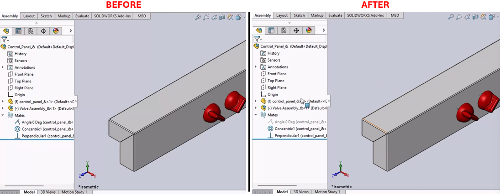

# Mate Toggling Macro for SolidWorks



## Description
This macro toggles the suppression state of a specified mate named "Angle 0 Deg" in a SolidWorks document. It first unsuppresses the mate if it is suppressed, then suppresses it again. This can be useful for automating the testing of assembly constraints.

## System Requirements
- **SolidWorks Version**: SolidWorks 2014 or newer
- **Operating System**: Windows 7 or later

## Pre-Conditions
> [!NOTE]
> The macro is run within an open SolidWorks assembly that contains a mate named "Angle 0 Deg."

## Results
- The mate "Angle 0 Deg" is toggled between suppressed and unsuppressed states.
- The assembly view is maximized before the operations (optional and can be enabled by uncommenting certain code lines).

## Steps to Setup the Macro

1. **Open SolidWorks**:
   - Ensure SolidWorks is open and an assembly with the specified mate is active.

2. **Access VBA Editor**:
   - Press (`Alt + F11`) to open the VBA editor in SolidWorks.

3. **Create a New Macro**:
   - Insert a new module and paste the provided VBA code.

4. **Run the Macro**:
   - Run the macro directly from the VBA editor or save it and run it from the SolidWorks Macro toolbar.

## VBA Macro Code

```vbnet
' Disclaimer:
' The code provided should be used at your own risk.  
' Blue Byte Systems Inc. assumes no responsibility for any issues or damages that may arise from using or modifying this code.  
' For more information, visit [Blue Byte Systems Inc.](https://bluebyte.biz).

Option Explicit

' Declare variables for the SolidWorks application and active document
Dim swApp As Object               ' SolidWorks application object
Dim Part As Object                ' Active document object (part or assembly)
Dim boolstatus As Boolean         ' Boolean to capture operation success
Dim longstatus As Long, longwarnings As Long ' Longs to capture detailed operation statuses

Sub main()
    ' Initialize the SolidWorks application object
    Set swApp = Application.SldWorks
    
    ' Get the currently active document
    Set Part = swApp.ActiveDoc

    ' Optional: Declare and set the active model view
    Dim myModelView As Object       ' Object for controlling the model view
    Set myModelView = Part.ActiveView
    
    ' Optional: Maximize the SolidWorks window (uncomment to enable functionality)
    ' myModelView.FrameState = swWindowState_e.swWindowMaximized
    
    ' Step 1: Select the mate named "Angle 0 Deg"
    boolstatus = Part.Extension.SelectByID2("Angle 0 Deg", "MATE", 0, 0, 0, False, 0, Nothing, 0)
    
    ' Step 2: Unsuppress the selected mate to activate it
    Part.EditUnsuppress2
    
    ' Step 3: Clear the current selection to reset the environment
    Part.ClearSelection2 True
    
    ' Step 4: Re-select the mate named "Angle 0 Deg"
    boolstatus = Part.Extension.SelectByID2("Angle 0 Deg", "MATE", 0, 0, 0, False, 0, Nothing, 0)
    
    ' Step 5: Suppress the selected mate to deactivate it
    Part.EditSuppress2
    
    ' Step 6: Clear the selection again to clean up the selection state
    Part.ClearSelection2 True
End Sub
```

## Macro
You can download the macro from [here](../images/Return_A_Axis_to_HOME1.swp)

## Customization
Need to modify the macro to meet specific requirements or integrate it with other processes? We provide custom macro development tailored to your needs. [Contact us](https://bluebyte.biz/contact).