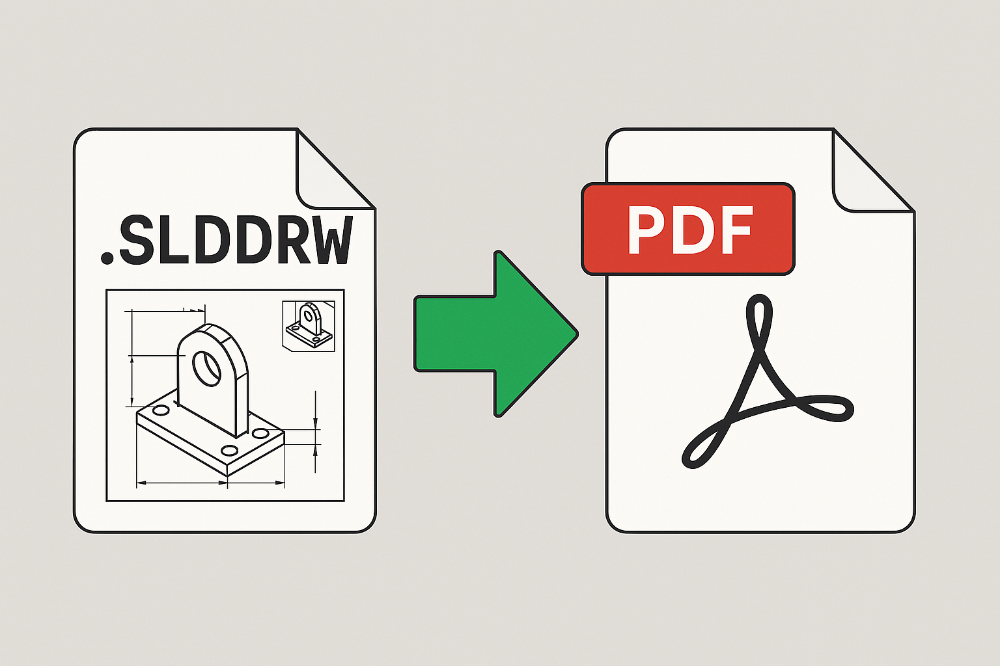

# Save Drawing as PDF Using Toolbar Button



## Description
This macro saves the active drawing as a PDF file, exporting all the sheets of the drawing document into a single PDF. It is intended to be used in conjunction with a custom toolbar button, making it easy for users to quickly save the active drawing as a PDF with just one click. 

## System Requirements
- **SolidWorks Version**: SolidWorks 2014 or newer
- **Operating System**: Windows 7 or later

## Pre-Conditions
> [!NOTE]
> - The active document must be a drawing that has been saved.
> - The drawing should not be read-only, and it should have a valid file path.
> - The macro will not work for parts or assemblies.

## Results
> [!NOTE]
> - All sheets of the active drawing are exported to a PDF file.
> - The PDF file is saved in the same location as the drawing, with the same name but with a `.PDF` extension.
> - A message box will display the save status, indicating whether the operation was successful or failed.

## VBA Macro Code

```vbnet
' Disclaimer:
' The code provided should be used at your own risk.  
' Blue Byte Systems Inc. assumes no responsibility for any issues or damages that may arise from using or modifying this code.  
' For more information, visit [Blue Byte Systems Inc.](https://bluebyte.biz).

Option Explicit

' --------------------------------------------------------------------------
' Main subroutine to save the active drawing as a PDF file
' --------------------------------------------------------------------------
Sub main()

    ' Declare and initialize necessary SolidWorks objects
    Dim swApp As SldWorks.SldWorks             ' SolidWorks application object
    Dim swModel As SldWorks.ModelDoc2          ' Active document object (drawing)
    Dim swModelDocExt As SldWorks.ModelDocExtension ' Document extension object for saving operations
    Dim swExportData As SldWorks.ExportPdfData ' PDF export data object
    Dim boolstatus As Boolean                  ' Boolean status to capture operation results
    Dim filename As String                     ' String to hold the file path of the drawing
    Dim lErrors As Long                        ' Error variable for save operation
    Dim lWarnings As Long                      ' Warning variable for save operation

    ' Initialize SolidWorks application and get the active document
    Set swApp = Application.SldWorks
    Set swModel = swApp.ActiveDoc

    ' Check if there is an active document open
    If swModel Is Nothing Then
        MsgBox "No current document. Please open a drawing and try again.", vbCritical, "No Active Document"
        End
    End If

    ' Check if the active document is a drawing
    If swModel.GetType <> swDocDRAWING Then
        MsgBox "This macro only works on drawings. Please open a drawing and try again.", vbCritical, "Invalid Document Type"
        End
    End If

    ' Get the document extension object for saving operations
    Set swModelDocExt = swModel.Extension

    ' Get the export PDF data object to specify PDF export options
    Set swExportData = swApp.GetExportFileData(swExportPDFData)

    ' Get the file path of the active drawing
    filename = swModel.GetPathName

    ' Check if the drawing has been saved previously (it must have a valid file path)
    If filename = "" Then
        MsgBox "Please save the file first and try again.", vbCritical, "File Not Saved"
        End
    End If

    ' Generate the PDF file path by changing the file extension to .PDF
    filename = Strings.Left(filename, Len(filename) - 6) & "PDF"

    ' Set the export option to include all sheets in the PDF file
    boolstatus = swExportData.SetSheets(swExportData_ExportAllSheets, 1)

    ' Save the drawing as a PDF file using the specified filename and options
    boolstatus = swModelDocExt.SaveAs(filename, 0, 0, swExportData, lErrors, lWarnings)

    ' Check if the save operation was successful and display a message box
    If boolstatus Then
        MsgBox "Save as PDF successful!" & vbNewLine & filename, vbInformation, "Save Successful"
    Else
        MsgBox "Save as PDF failed. Error code: " & lErrors, vbExclamation, "Save Failed"
    End If

End Sub
```

## Macro
You can download the macro from [here](../images/Save_Drawing_As_Pdf_2.swp)

## Customization
Need to modify the macro to meet specific requirements or integrate it with other processes? We provide custom macro development tailored to your needs. [Contact us](https://bluebyte.biz/contact).
