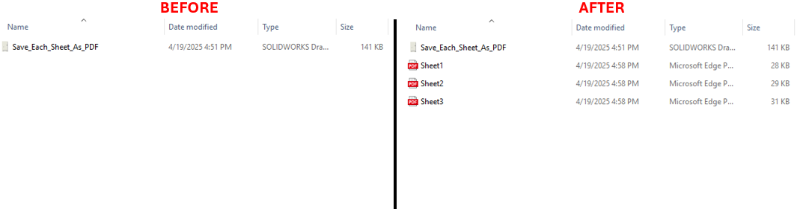

# Export Sheets to PDF Automatically



## Description
This VBA macro automates the process of exporting all sheets in a SOLIDWORKS drawing to individual PDF files. The macro loops through all the sheets in the active drawing and exports each one as a PDFs into the folder that the drawing file is in.


## System Requirements
- **SOLIDWORKS Version**: SOLIDWORKS 2018 or later
- **VBA Environment**: Pre-installed with SOLIDWORKS (Access via Tools > Macro > New or Edit)
- **Operating System**: Windows 7, 8, 10, or later

## VBA Code:
```vbnet
Option Explicit

' DISCLAIMER: 
' This macro is provided "as is" without any warranty. Blue Byte Systems Inc. is not liable for any issues that arise 
' from its use. Always test the macro in a safe environment before applying it to production data.

Dim swApp As SldWorks.SldWorks

Sub ExportSheetsToPDF()

    ' Set the SOLIDWORKS application object
    Set swApp = Application.SldWorks
    
    ' Check if SOLIDWORKS is running
    If swApp Is Nothing Then
        MsgBox "Error Connecting to SOLIDWORKS. Please Try Again.", vbCritical
        Exit Sub
    End If
    
    ' Set the active document object
    Dim swDoc As ModelDoc2
    Set swDoc = swApp.ActiveDoc
    
    ' Check if the active document is valid
    If swDoc Is Nothing Then
        MsgBox "Unable to Connect to a Valid SOLIDWORKS Drawing.", vbCritical
        Exit Sub
    End If
    
    ' Ensure the active document is a drawing
    If swDoc.GetType <> SwConst.swDocumentTypes_e.swDocDRAWING Then
        MsgBox "The active document is not a SOLIDWORKS drawing.", vbCritical
        Exit Sub
    End If
    
    ' Set the drawing document object
    Dim swDwgDoc As DrawingDoc
    Set swDwgDoc = swDoc
    
    ' Set the PDF export data object
    Dim swExportPdfData As SldWorks.ExportPdfData
    Set swExportPdfData = swApp.GetExportFileData(SwConst.swExportDataFileType_e.swExportPdfData)
    
    ' Get the output directory from the drawing's path
    Dim outputPath As String
    outputPath = GetFolderFromPath(swDoc.GetPathName)
    
    ' Get the list of sheet names in the drawing
    Dim sheetNames As Variant
    sheetNames = swDwgDoc.GetSheetNames
    
    ' Set the current sheet object
    Dim swSheet As Sheet
    Set swSheet = swDwgDoc.GetCurrentSheet
    
    ' Generate the base output file name
    Dim outputFileName As String
    outputFileName = GetFileNameFromTitle(swDoc.GetTitle, swSheet.GetName)
    
    ' Initialize variables for error handling
    Dim lErrors As Long
    Dim lWarnings As Long
    Dim i As Integer
    Dim exportSuccess As Boolean
    
    ' Display the export status in the SOLIDWORKS status bar
    Dim statusBarPane As StatusBarPane
    Dim swFrame As SldWorks.Frame
    
    Set swFrame = swApp.Frame
    Set statusBarPane = swFrame.GetStatusBarPane
    statusBarPane.Visible = True
    
    ' Loop through each sheet and export to PDF
    For i = 0 To UBound(sheetNames)
        
        ' Update the status bar with the current sheet being exported
        statusBarPane.Text = "Exporting sheet: " & sheetNames(i)
        
        ' Set the current sheet for PDF export
        exportSuccess = swExportPdfData.SetSheets(SwConst.swExportDataSheetsToExport_e.swExportData_ExportSpecifiedSheets, sheetNames(i))
        
        ' Check for errors in setting the sheet
        If Not exportSuccess Then
            MsgBox "Error exporting sheet: " & Str(i), vbCritical
            Exit Sub
        End If
        
        ' Export the current sheet as PDF
        exportSuccess = swDoc.Extension.SaveAs(sheetNames(i) & ".pdf", SwConst.swSaveAsVersion_e.swSaveAsCurrentVersion, _
                                               SwConst.swSaveAsOptions_e.swSaveAsOptions_Silent, swExportPdfData, lErrors, lWarnings)
        
        ' Check for errors during the export
        If Not exportSuccess Then
            MsgBox "Error exporting sheet: " & Str(i), vbCritical
            HandleErrors lErrors
            Exit Sub
        End If
    Next i
End Sub

' Function to get the folder path from the full file path
Private Function GetFolderFromPath(fullPath As String) As String
    GetFolderFromPath = Left(fullPath, InStrRev(fullPath, "\"))
End Function

' Function to get the file name without the sheet name
Private Function GetFileNameFromTitle(fullTitle As String, sheetName As String) As String
    GetFileNameFromTitle = Left(fullTitle, InStrRev(fullTitle, sheetName) - 1)
End Function

' Sub to handle errors based on error codes
Private Sub HandleErrors(errorCode As Long)
    Select Case errorCode
        Case SwConst.swFileSaveError_e.swGenericSaveError
            MsgBox "File Saving Error", vbExclamation
        Case SwConst.swFileSaveError_e.swReadOnlySaveError
            MsgBox "File Saving Error: Read-Only Rights", vbExclamation
        Case SwConst.swFileSaveError_e.swFileNameEmpty
            MsgBox "File Saving Error: Empty Filename", vbExclamation
        Case SwConst.swFileSaveError_e.swFileNameContainsAtSign
            MsgBox "File Saving Error: Invalid FileName Character", vbExclamation
        Case SwConst.swFileSaveError_e.swFileSaveFormatNotAvailable
            MsgBox "File Saving Error: Invalid File Format", vbExclamation
        Case SwConst.swFileSaveError_e.swFileSaveAsNameExceedsMaxPathLength
            MsgBox "File Saving Error: Filename Exceeds Maximum Path Length", vbExclamation
    End Select
End Sub
```

## Macro
You can download the macro from [here](../images/Save_Each_Sheet_As_PDF.swp)

## Customization
Need to modify the macro to meet specific requirements or integrate it with other processes? We provide custom macro development tailored to your needs. [Contact us](https://bluebyte.biz/contact).