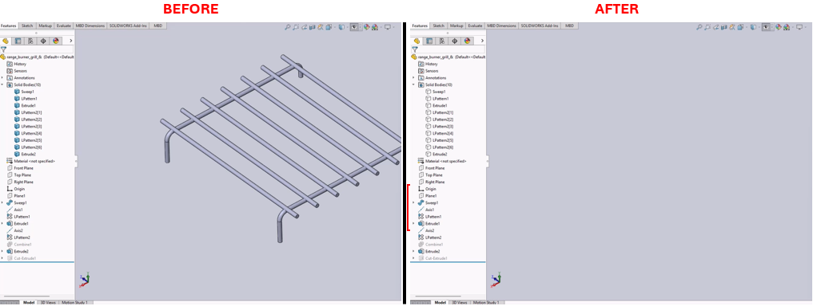

# Show and Hide Solid Bodies in SolidWorks



## Description
This macro toggles the visibility of solid bodies in a SolidWorks model by selecting the "Solid Bodies" folder (named "Corps volumiques" in French) and using the `HideBodies` and `ShowBodies` methods. This macro is useful for quickly hiding and then showing all solid bodies in a part document.

## System Requirements
- **SolidWorks Version**: SolidWorks 2014 or newer
- **Operating System**: Windows 7 or later

## Pre-Conditions
> [!NOTE]
> - The active document must be a part file with solid bodies.
> - The "Solid Bodies" folder must be named "Corps volumiques" (French localization) for the macro to work as-is.

## Results
> [!NOTE]
> - All solid bodies in the model are first hidden, then shown.
> - The macro clears selections and selects the "Solid Bodies" folder as needed.

## VBA Macro Code

```vbnet
' Disclaimer:
' The code provided should be used at your own risk.  
' Blue Byte Systems Inc. assumes no responsibility for any issues or damages that may arise from using or modifying this code.  
' For more information, visit [Blue Byte Systems Inc.](https://bluebyte.biz).

Option Explicit

' Main subroutine to toggle visibility of solid bodies
Dim swApp As Object
Dim Part As Object
Dim boolstatus As Boolean
Dim longstatus As Long, longwarnings As Long

Sub main()

    ' Initialize the SolidWorks application object
    Set swApp = Application.SldWorks

    ' Get the active document (must be a part)
    Set Part = swApp.ActiveDoc
    
    ' Select the "Solid Bodies" folder (localized as "Corps volumiques")
    boolstatus = Part.Extension.SelectByID2("Corps volumiques", "BDYFOLDER", 0, 0, 0, False, 0, Nothing, 0)
    boolstatus = Part.Extension.SelectByID2("Corps volumiques", "BDYFOLDER", 0, 0, 0, False, 0, Nothing, 0)
    
    ' Hide all solid bodies in the folder
    Part.FeatureManager.HideBodies
    
    ' Clear selection to reset
    Part.ClearSelection2 True
    
    ' Re-select the "Solid Bodies" folder to toggle visibility back
    boolstatus = Part.Extension.SelectByID2("Corps volumiques", "BDYFOLDER", 0, 0, 0, False, 0, Nothing, 0)
    boolstatus = Part.Extension.SelectByID2("Corps volumiques", "BDYFOLDER", 0, 0, 0, False, 0, Nothing, 0)
    
    ' Show all solid bodies in the folder
    Part.FeatureManager.ShowBodies
    
End Sub
```

## Macro
You can download the macro from [here](../images/ShowHideBodies.swp)

## Customization
Need to modify the macro to meet specific requirements or integrate it with other processes? We provide custom macro development tailored to your needs. [Contact us](https://bluebyte.biz/contact).