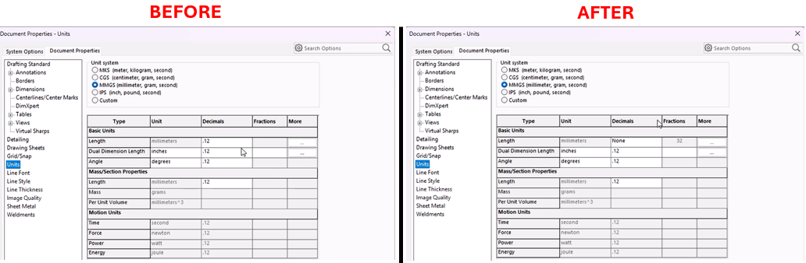

# Toggle Dimension Style Between Fraction and Decimal



## Description
This macro automates the process of switching between decimal and fractional units in a SolidWorks document. It first checks whether the current unit system is set to decimal. If it is, the macro changes the unit system to fractional, sets the fractional denominator to 1/32, and enables rounding to the nearest fraction. If the current units are fractional, the macro changes the system back to decimal. The macro ensures that users can quickly toggle between these two unit types without manually adjusting the settings. Additionally, it includes error handling to terminate gracefully if any issues arise.

## System Requirements
- **SolidWorks Version**: SolidWorks 2014 or newer
- **Operating System**: Windows 10 or later

## Pre-Conditions
> [!NOTE]
> - SolidWorks must be installed and running on the machine.
> - An active drawing is open.
> - Drawing views with dimensions.

## Post-Conditions
> [!NOTE]
> - The macro will switch the dimension style between fractional and decimal, and vice versa.
> 

 
## VBA Macro Code

```vbnet
' Disclaimer:
' The code provided should be used at your own risk.  
' Blue Byte Systems Inc. assumes no responsibility for any issues or damages that may arise from using or modifying this code.  
' For more information, visit [Blue Byte Systems Inc.](https://bluebyte.biz).

Option Explicit

Dim swApp As SldWorks.SldWorks             ' SolidWorks application object
Dim swDraw As SldWorks.DrawingDoc              ' Active drawing document
Dim boolstatus As Boolean       ' Status flag for checking if operations were successful


Sub main()
    ' Error handling: jump to ErrorHandler if an error occurs
    On Error GoTo ErrorHandler
    
    ' Get the SolidWorks application instance
    Set swApp = Application.SldWorks

    ' Get the active document (drawing) in SolidWorks
    Set swDraw = swApp.ActiveDoc

    ' Check if the current unit system is set to Decimal
    If swDraw.GetUserPreferenceIntegerValue(swUnitsLinearDecimalDisplay) = swDECIMAL Then
        ' If Decimal, change the unit system to Fractional
        boolstatus = swDraw.Extension.SetUserPreferenceToggle(swUserPreferenceToggle_e.swUnitsLinearRoundToNearestFraction, 0, True)
        ' Set linear display to fractional units
        swDraw.SetUserPreferenceIntegerValue swUnitsLinearDecimalDisplay, swFRACTION
        ' Set the fractional denominator to 32 (1/32 increments)
        swDraw.SetUserPreferenceIntegerValue swUnitsLinearFractionDenominator, 32
        ' Enable rounding to the nearest fraction
        swDraw.SetUserPreferenceToggle swUnitsLinearRoundToNearestFraction, True
    Else
        ' If the current unit system is not Decimal (i.e., it's Fractional), change it to Decimal
        boolstatus = swDraw.Extension.SetUserPreferenceInteger(swUserPreferenceIntegerValue_e.swUnitsLinearDecimalDisplay, 0, swFractionDisplay_e.swDECIMAL)
        ' Set linear display to decimal units
        swDraw.SetUserPreferenceIntegerValue swUnitsLinearDecimalDisplay, swDECIMAL
    End If

    ' End the macro execution
    End
    Exit Sub

ErrorHandler:
    ' End the macro execution in case of an error
    End
End Sub
```

## Macro
You can download the macro from [here](../images/fract_dec_toggle1.swp)

## Customization
Need to modify the macro to meet specific requirements or integrate it with other processes? We provide custom macro development tailored to your needs. [Contact us](https://bluebyte.biz/contact).