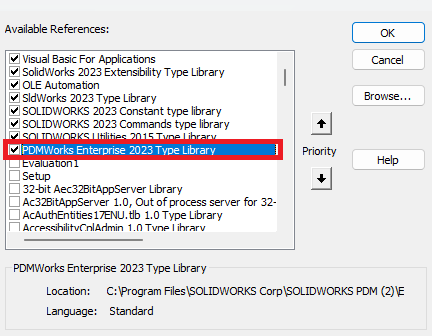

# Made Changes To File But Forgot to Check It Out


Make sure to add the PDMWorks Enterprise reference before you run this macro from References > Tools.




## Macro Description

This VBA macro is useful to preserve changes made to a file that has not been checked out in SOLIDWORKS. It will check out the file from the vault and then all the changes made to the file when it was read only allowing you to save the changes you made to the file and check it back into the vault
## VBA Macro Code


```vbnet
'The code provided is for educational purposes only and should be used at your own risk. 
'Blue Byte Systems Inc. assumes no responsibility for any issues or damages that may arise from using or modifying this code. 
'For more information, visit [Blue Byte Systems Inc.](https://bluebyte.biz).

Dim swApp As SldWorks.SldWorks
Dim edmvault As EdmVault5
Dim swmodeldoc As ModelDoc2
dim vaultName as string 
Sub main()

' change this to your vault name 

vaultName = "bluebyte"

Set swApp = Application.SldWorks

Dim frame As frame

Set frame = swApp.frame

Dim handle As Long

handle = frame.GetHWnd

Set edmvault = New EdmVault5

edmvault.LoginAuto vaultName, handle

Set swmodeldoc = swApp.ActiveDoc

Dim filePath As String

filePath = swmodeldoc.GetPathName

Dim file As IEdmFile5

Dim folder As IEdmFolder5

Set file = edmvault.GetFileFromPath(filePath, folder)

Debug.Print file.Name

swmodeldoc.ForceReleaseLocks

file.LockFile folder.ID, handle

swmodeldoc.ReloadOrReplace False, filePath, False

End Sub


```

## System Requirements
To run this VBA macro, ensure that your system meets the following requirements:

- **SOLIDWORKS Version**: SOLIDWORKS and PDM 2017 or later
- **VBA Environment**: Pre-installed with SOLIDWORKS (Access via Tools > Macro > New or Edit)
- **Operating System**: Windows 7, 8, 10, or later
- **Additional Libraries**: PDMWorks Enterprise

## Customization
Need to modify the macro to meet specific requirements or integrate it with other processes? We provide custom macro development tailored to your needs. [Contact us](https://bluebyte.biz/contact).