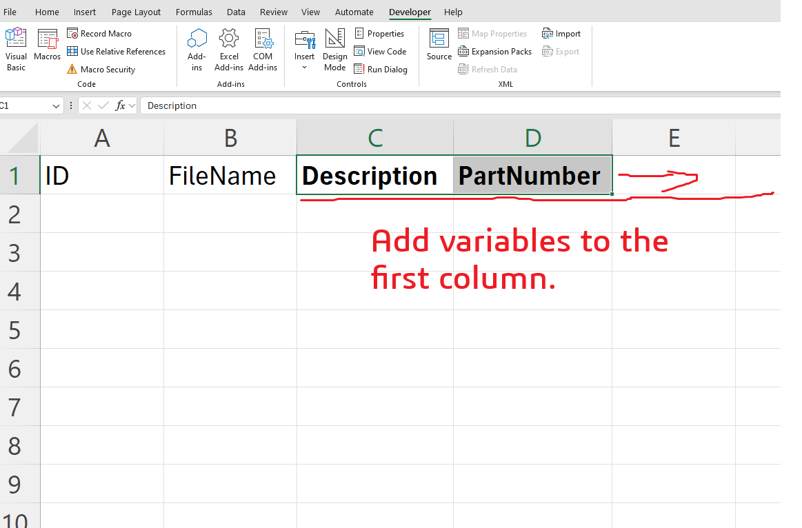

> [!NOTE]   
> ▶️🚨 Watch the video where we wrote this macro and subscribe to our YouTube stream where we make live programming on the SOLIDWORKS API!  
> [Watch Now!](https://www.youtube.com/watch?v=woBl13TKhpQ)  
> Hit the **Subscribe** button and stay updated with our live streams!  


# Mass Edit Files DataCard Variables From Excel

Make sure to add the PDMWorks Enterprise reference before you run this macro from References > Tools.


## Macro Description

This VBA macro is useful to collect the values of data card variables for all files found in a folder. The macro will ask you for a folder in PDM and read fill the variables from PDM to Excel.





## Excel Macro File

Download it from [here](../images/masseditfilesdatacardfromexcel.xlsm)

## VBA Macro Code


```vbnet
'The code provided is for educational purposes only and should be used at your own risk.
'Blue Byte Systems Inc. assumes no responsibility for any issues or damages that may arise from using or modifying this code.
'For more information, visit [Blue Byte Systems Inc.](https://bluebyte.biz).
Sub ReadFolderFilesVariables()

Dim vault As EdmVault5

Set vault = New EdmVault5


Dim handle As Long

handle = Application.Hwnd

vault.LoginAuto "bluebyte", handle

Dim folderPath As String

Dim vaultrootFolderPath As String

vaultrootFolderPath = vault.RootFolderPath

folderPath = InputBox("Path:", "Folder Content Variables Updater", vaultrootFolderPath)

Dim colIndex As Integer
colIndex = 2

Dim folder As IEdmFolder5

Set folder = vault.GetFolderFromPath(folderPath)

Dim position As IEdmPos5
Dim file As IEdmFile5
Set position = folder.GetFirstFilePosition

While position.IsNull = False

 Set file = folder.GetNextFile(position)

 ' fill the excel range with file metadata
 Dim variableEnumerator As IEdmEnumeratorVariable8
 Set variableEnumerator = file.GetEnumeratorVariable
 Range("A" & colIndex).Value = file.ID
 Range("B" & colIndex).Value = file.Name
 Dim description
 variableEnumerator.GetVarFromDb "Description", "@", description
 Range("C" & colIndex).Value = description
 
 Dim partNumber
 variableEnumerator.GetVarFromDb "PartNumber", "@", partNumber
 Range("D" & colIndex).Value = partNumber
 colIndex = colIndex + 1
 
 variableEnumerator.CloseFile True
Wend


End Sub


Sub UpdateFolderFilesVariables()

Dim vault As EdmVault5

Set vault = New EdmVault5


Dim handle As Long

handle = Application.Hwnd

vault.LoginAuto "bluebyte", handle

Dim lastRow As Integer
Dim folderID As Long
folderID = -1

lastRow = Cells(Rows.Count, 1).End(xlUp).Row


For i = 2 To lastRow

 Dim ID As Long
 Dim file As IEdmFile5
 ID = Range("A" & i).Value
 Set file = vault.GetObject(EdmObject_File, ID)
 
 If folderID = -1 Then
  folderID = GetFolderIDFromFromRowTwo(file)
 End If
 
'check out file
On Error GoTo errorHandler:
If file.IsLocked = False Then
 file.LockFile folderID, handle
End If
 'set my variables
 Dim variableEnumerator As IEdmEnumeratorVariable8
 Set variableEnumerator = file.GetEnumeratorVariable
 
 Dim description
 description = Range("C" & i).Value
 
 Dim partNumber
 partNumber = Range("D" & i).Value
 
 variableEnumerator.SetVar "Description", "@", description
 variableEnumerator.SetVar "PartNumber", "@", partNumber
 
 variableEnumerator.CloseFile True
 
 file.UnlockFile handle, "Updated datacard"

errorHandler:
 Debug.Print Err.description
Next i
Debug.Print "Completed"

  
End Sub

Public Function GetFolderIDFromFromRowTwo(ByRef file As IEdmFile5) As Long

 Dim position As IEdmPos5
 Dim folder As IEdmFolder5
 Dim folderID As Long
 Set position = file.GetFirstFolderPosition
 Set folder = file.GetNextFolder(position)
 folderID = folder.ID
 GetFolderIDFromFromRowTwo = folderID
 

End Function


```

## System Requirements
To run this VBA macro, ensure that your system meets the following requirements:

- **SOLIDWORKS Version**: SOLIDWORKS and PDM 2017 or later
- **VBA Environment**: Pre-installed with SOLIDWORKS (Access via Tools > Macro > New or Edit)
- **Operating System**: Windows 7, 8, 10, or later
- **Additional Libraries**: PDMWorks Enterprise

## Customization
Need to modify the macro to meet specific requirements or integrate it with other processes? We provide custom macro development tailored to your needs. [Contact us](https://bluebyte.biz/contact).